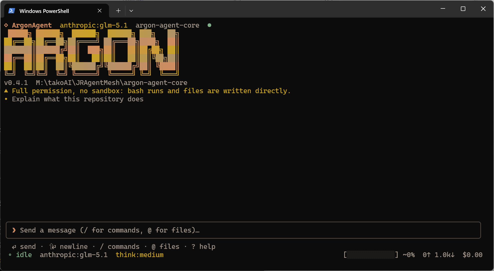

<p align="center">
  
</p>

# AragonAgent

A zero-coupling TypeScript agent engine, extracted from AragonMesh's "JR Agent"
core so it can be reused across projects and published to the public registry.

AragonAgent provides the full agentic LLM execution loop:

- **LLM provider adapters** — Anthropic, OpenAI, Google, with a pluggable
  provider registry and streaming (`streamLLM` / `completeLLM`).
- **Tool system** — typed tool definitions, a registry, a JSON-Schema validator
  (uses `ajv` when available, falls back to a built-in validator), and an
  executor with per-tool timeouts.
- **Engine** — multi-turn agent loop, message management, a steering/follow-up
  queue, and an idle watchdog.
- **Skills** — reusable expert procedures on disk, surfaced to the model through
  three levels of progressive disclosure so fifty of them cost a few thousand
  characters of context. Parsing, validation, budgeting and rendering live in
  core; all I/O lives in the CLI behind an injected `SkillHost` port. See the
  [Skills section of the CLI README](packages/cli/README.md#skills).
- **Optional sandbox** — an `isolated-vm` based JavaScript CodeAct sandbox
  (lazy-loaded; `isolated-vm` is an optional dependency).

The engine is **dependency-injected**: you supply the provider registry, an
API-key resolver, the tool list, and the model reference. It holds no database,
no persistence, and no framework coupling.

## Layout

This repository is an npm-workspaces mono-repo:

```
aragon-agent-core/
  package.json            # workspaces root (private)
  tsconfig.base.json      # shared compiler options (ES2022 / NodeNext / strict)
  packages/
    core/                 # @aragon-agent/core — the publishable engine
    cli/                  # @aragon-agent/cli  — the interactive terminal UI (TUI)
```

At run time the CLI keeps everything it owns in one directory in the user's
home — `~/.aragon-agent/` (`C:\Users\<you>\.aragon-agent\` on Windows), holding
`config.json`, `logs/`, `sessions/` and installed `skills/`. `ARAGON_HOME`
relocates it; `aragon config home` prints whichever is in effect. Nothing under
this repository is written to at run time.

## CLI

[`@aragon-agent/cli`](./packages/cli) is a Claude-Code / Codex-style interactive
terminal UI built on top of the engine. Run `aragon` in any directory for a
full-screen, keyboard-driven chat with a built-in filesystem/shell toolset.

<p align="center">
  
</p>

```bash
# Global
npm i -g @aragon-agent/cli
aragon

# Zero-install
npx @aragon-agent/cli
```

From a clone of this monorepo, build and launch it against your working copy
instead:

```bash
npm run dev:cli          # build + launch the TUI from this monorepo
aragon "summarize README" # or one-shot: echo "list files" | aragon -p
```

See [`packages/cli/README.md`](./packages/cli/README.md) for install, usage,
keybindings, slash commands, and configuration.

## Use it from another project

The same binary has a second, machine-facing face. `aragon exec` gives a build
script, a CI job, a web backend or another agent a contract to code against: a
versioned JSON event stream on stdout, sessions that survive across process
boundaries, tool permissions enforced at the tool boundary rather than promised
in a prompt, and caller-set budgets with their own exit code.

```bash
npm i -g @aragon-agent/cli

aragon info --json                                          # what does this build support?
aragon exec --output-format json "summarize src/index.ts"   # answer + usage + cost
aragon exec --permission-mode strict --allow-tool read_file,grep \
  --max-turns 20 --output-format stream-json "find the retry policy"
```

Reading the stream from Node:

```js
import { spawn } from 'node:child_process';
import readline from 'node:readline';

const child = spawn('aragon', ['exec', '--output-format', 'stream-json', 'hi'], {
  stdio: ['ignore', 'pipe', 'inherit'],
});

let result = null;
readline.createInterface({ input: child.stdout }).on('line', (line) => {
  try {
    const event = JSON.parse(line);
    if (event.type === 'result') result = event;
    // Ignore event types you do not know — that is the forward-compatibility contract.
  } catch {
    /* never fatal */
  }
});
// Resolve on exit as well as on `result`: process exit is terminal either way.
child.on('close', (code) => console.log(code, result?.result));
```

Full reference — output formats, the event schema, permission modes, session
continuity, budgets, exit codes, and an honest list of the limits (there is no
filesystem sandbox) — is in
[`packages/cli/README.md`](./packages/cli/README.md#use-it-from-another-project).

## Quick start

```ts
import { AragonAgent, getProviderRegistry, initProviders } from '@aragon-agent/core';

initProviders();

const agent = new AragonAgent({
  systemPrompt: 'You are a coding agent.',
  model: { providerId: 'anthropic', modelId: 'claude-...', baseUrl: '...' },
  tools: [],
  providerRegistry: getProviderRegistry(),
  getApiKey: () => process.env.ANTHROPIC_API_KEY,
});

await agent.prompt('Hello');
```

`AragonAgent` is an alias of the engine's `Agent` class — both are exported.

## Build & test

```bash
npm install
npm run build        # builds every package (tsc → dist)
npm test             # runs each package's test suite
```

## Publishing

`@aragon-agent/core` is published from its own package directory, not from the
workspace root. See [`packages/core/README.md`](./packages/core/README.md#publishing)
for the full release procedure (`cd packages/core && npm publish`, or
`npm publish -w packages/core` from the root).

## License

MIT — see [LICENSE](./LICENSE).
