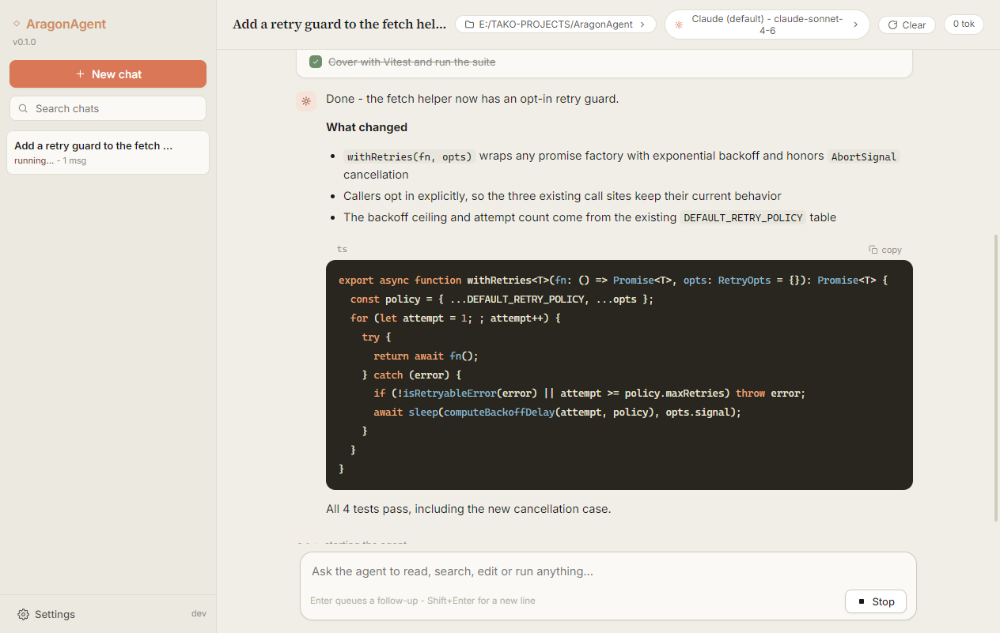

<p align="center">
  
</p>

<h1 align="center">AragonAgent</h1>

<p align="center">
  <strong>An open-source coding agent that lives in your terminal —<br />and the embeddable engine it runs on.</strong>
</p>

<p align="center">
  A Claude&nbsp;Code / Codex-style interactive TUI, a zero-coupling TypeScript agent engine,
  and a stable machine-facing CLI contract — in one MIT-licensed monorepo.
</p>

<p align="center">
  <a href="https://www.npmjs.com/package/@aragon-agent/cli"></a>
  <a href="https://www.npmjs.com/package/@aragon-agent/core"></a>
  <a href="https://github.com/xdrshjr/AragonAgent/blob/main/LICENSE"></a>
  
  
  <a href="https://github.com/xdrshjr/AragonAgent/stargazers"></a>
</p>

<p align="center">
  
</p>

---

## Why another agent?

Most coding agents are one of two things: a **closed product** you can only use the way
the vendor intends, or a **framework** that stops at "here is an LLM loop, good luck."

AragonAgent is deliberately both faces of the same machine:

| You want to… | You use |
| --- | --- |
| Chat with an agent in your terminal and watch it work | **`aragon`** — the interactive TUI |
| Use the same agent in a native desktop app | **AragonAgent Desktop** — Electron + Next.js, multi-session |
| Embed an agent loop in your own app, with your own tools | **`@aragon-agent/core`** — the engine |
| Drive an agent from a script, CI job, or another agent | **`aragon exec`** — the JSON contract |

The same loop that streams into your terminal is a library you can import and a
subprocess you can spawn. Nothing about the engine assumes a terminal exists.

## Highlights

- **Terminal-native TUI** — full-screen streaming chat, live tool-call cards, scrollback,
  themes, queued follow-ups while the agent runs, and a status bar that tracks context
  usage, tokens, and session cost.
- **A native desktop app** — the same agent in an Electron + Next.js shell: multi-session
  chat with a warm, calm UI, model profiles (Anthropic / OpenAI / any OpenAI-compatible
  endpoint), encrypted key storage, one-click connection tests, and a manual
  clear-context control. Packaged installers need no system Node install.
- **Bring your own model** — first-class adapters for **Anthropic, OpenAI, and Google**,
  a pluggable provider registry, and automatic retry with backoff across every stream.
- **Team subagents** — the agent can hand parts of a job to short-lived subagents that
  run in parallel and return one combined report. Depth-capped by construction.
- **Plan mode & TODO planning** — a read-only planning mode (`Shift+Tab`) where the agent
  investigates first and asks before touching anything, plus a live todo list it keeps
  honest as it works.
- **Skills** — reusable expert procedures on disk, surfaced to the model through three
  levels of progressive disclosure, with an explicit `allowed-tools` ceiling per skill.
- **Context that survives** — a context gauge, automatic compaction with a restorable
  archive, and sessions that resume across process boundaries.
- **Background services** — the agent can start a dev server, see it come up, and stop
  it; supervised children are reaped on exit, best-effort, even on hard crashes.
- **A real machine contract** — `aragon exec` emits a versioned NDJSON event stream, with
  tool permissions enforced at the tool boundary, caller-set budgets, stable exit codes,
  and `aragon info --json` / `aragon doctor` for introspection.
- **An engine, not a framework** — dependency-injected, ESM-only TypeScript, zero
  database / persistence / host coupling, JSON-Schema-validated tools with per-tool
  timeouts, and an optional `isolated-vm` CodeAct sandbox.
- **Fast model tier** — an optional cheap second model for reflection and review, so the
  expensive one only spends tokens on the work itself.

## Get started in 30 seconds

```bash
# 1. Install (Node ≥ 18)
npm i -g @aragon-agent/cli

# 2. Set any one key (or paste it live in the TUI via /settings)
export ANTHROPIC_API_KEY=sk-ant-...

# 3. Run — full-screen interactive TUI, in any directory
aragon
```

Prefer to look before you install?

```bash
npx @aragon-agent/cli          # zero-install one-off
aragon "summarize README.md"   # interactive, auto-submits the prompt
echo "list files" | aragon -p  # one-shot: print, exit, pipeable
```

From a clone of this monorepo: `npm install && npm run dev:cli` builds and launches the
TUI against your working copy.

## Embed the engine

```bash
npm install @aragon-agent/core
```

```ts
import {
  AragonAgent, defineTool, textResult,
  getProviderRegistry, initProviders,
  type AgentTool, type ModelRef,
} from '@aragon-agent/core';

const greet: AgentTool = defineTool({
  name: 'greet',
  label: 'Greeter',
  description: 'Greets the user by name.',
  parameters: {
    type: 'object',
    properties: { name: { type: 'string' } },
    required: ['name'],
  },
  async execute(_id, params) {
    const name = typeof params.name === 'string' ? params.name : 'world';
    return textResult(`Hello, ${name}!`);
  },
});

initProviders();

const model: ModelRef = { providerId: 'anthropic', modelId: 'claude-sonnet-4-6' };

const agent = new AragonAgent({
  systemPrompt: 'You are a helpful coding agent.',
  model,
  tools: [greet],
  providerRegistry: getProviderRegistry(),
  getApiKey: (providerId) => process.env.ANTHROPIC_API_KEY,
});

await agent.prompt('Greet the world.');
```

You supply the provider registry, an API-key resolver, the tool list, and the model
reference — the engine holds no database, no persistence, and no framework coupling.
`AragonAgent` is an alias of the engine's `Agent` class; the full public surface is
frozen by a contract test and documented in
[`packages/core/API.md`](./packages/core/API.md).

## Drive it from another program

`aragon exec` gives a build script, a CI job, a web backend, or another agent a contract
to code against:

```bash
aragon info --json                                            # what does this build support?
aragon exec --output-format json "summarize src/index.ts"     # answer + usage + cost

# a research agent that can read, search, and plan — but touch nothing
aragon exec --permission-mode strict --allow-tool read_file,grep \
  --max-turns 20 --output-format stream-json "find the retry policy"
```

`stream-json` emits one JSON object per line (init, turns, tool calls, todos, result);
ignore event types you do not know — that is the forward-compatibility contract. The
full reference — output formats, the event schema, permission modes, session
continuity, budgets, exit codes — is in
[`packages/cli/README.md`](./packages/cli/README.md#use-it-from-another-project).

## The repository

```
aragon-agent-core/
  packages/
    core/    @aragon-agent/core  — the publishable engine (ESM-only, Node ≥ 18)
    cli/     @aragon-agent/cli   — the interactive TUI + the exec contract
  logo/      brand + screenshots
  desktop/  AragonAgent Desktop — Electron + Next.js host, packaged installer
```

At run time the CLI keeps everything it owns in one directory in the user's home —
`~/.aragon-agent/` — holding `config.json`, `logs/`, `sessions/`, and installed
`skills/`. `ARAGON_HOME` relocates it; `aragon config home` prints whichever is in
effect. Nothing under this repository is written to at run time.

## AragonAgent Desktop

<p align="center">
  
</p>

The desktop app is a thin host around the same `aragon exec` machine contract the CLI
exposes - each conversation session runs as a supervised child process, so every
capability of the TUI (tools, durable sessions, auto-compaction, budgets, interrupts)
works unchanged:

- **Multi-session** — concurrent chats, journal replay on reopen, resume across app
  restarts, queue follow-ups while a turn runs.
- **Model profiles** — Anthropic, OpenAI, or any OpenAI-compatible endpoint
  (DeepSeek, Qwen, Ollama gateways...); API keys encrypted with the OS credential
  store; live connection test; switch model or working folder mid-conversation.
- **Context control** — automatic compaction notices plus a manual *Clear* that gives
  the model a fresh window while your transcript stays readable.

Build it from a clone:

```bash
npm install
npm run dev:desktop        # develop (hot reload)
npm run package:desktop    # NSIS installer + portable exe (win x64)
```

Details in [`desktop/README.md`](./desktop/README.md).
## Documentation

| Document | What is in it |
| --- | --- |
| [`packages/cli/README.md`](./packages/cli/README.md) |
| [`desktop/README.md`](./desktop/README.md) | The desktop app: architecture, development, tests, packaging | The CLI: install, keybindings, slash commands, plan mode, teams, skills, compaction, configuration |
| [`packages/core/README.md`](./packages/core/README.md) | The engine: entry points, optional dependencies, publishing |
| [`packages/core/API.md`](./packages/core/API.md) | The frozen public API surface of `@aragon-agent/core` |
| [`packages/cli/CHANGELOG.md`](./packages/cli/CHANGELOG.md) | Release history |

## Honest limits

- **Full permission, no sandbox, by default.** `bash` executes directly, file writes hit
  the real filesystem, and there is no per-action approval gate unless you ask for one.
  Only run it in workspaces you trust; opt in with `--confirm` or
  `--permission-mode strict`.
- **Early-stage and Windows-first.** Developed and daily-driven on Windows Terminal /
  PowerShell, with cross-platform fallbacks (e.g. `Ctrl+P` where `Shift+Tab` cannot
  work). Expect fewer polished edges than a funded product.

## Contributing

```bash
git clone https://github.com/xdrshjr/AragonAgent
cd AragonAgent
npm install
npm run build        # builds every package (tsc → dist)
npm test             # runs each package's test suite
npm run dev:cli      # build + launch the TUI from this monorepo
```

Issues and pull requests are welcome. A good first move is reproducing something you
think is wrong in an issue before changing code.

## Star history

[](https://star-history.com/#xdrshjr/AragonAgent&Date)

## License

MIT — see [LICENSE](./LICENSE).
