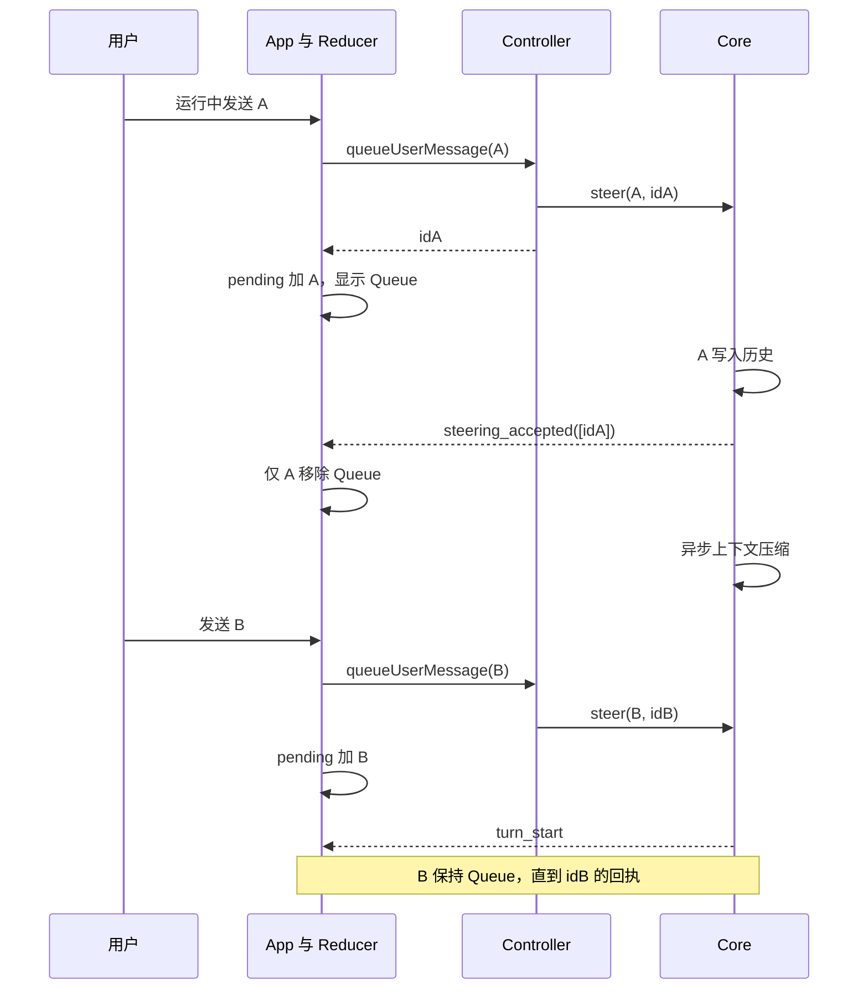

# TUI 输入、显式复制与消息排队反馈设计

> 版本：v2；日期：2026-10-07；状态：设计评审通过。
> 本轮唯一设计入口：`docs/plans/tui-input-interaction-hardening/spec.md`。
> 本节点仅编写规格，不实施代码、不提交 Git；下文代码块均为接口约定。

## 评审记录

本轮对照当前工作区源码、CLAUDE.md、已安装 Ink 输入实现及官方终端协议逐节评审。
工作区既有未提交代码不是本节点产物；以下“已修订”仅表示设计问题已在正文消除，
不表示实现或真实终端验收已完成。P0：0 项；P1：7 项；P2：3 项，均已修订。

| 编号 | 等级 | 问题与证据 | 正文修订及验证入口 | 状态 |
| --- | --- | --- | --- | --- |
| R-01 | P1 | §3.1 保留裸 CR，但 §3.2 未规定混合 CR 的消费；Ink 只将独立 CR 识别为 return，现有 sanitiseTyped 会删掉混合 CR，导致 paste/newline 后的 Enter 丢失 | §3.1–3.2 明确 CR 在粘贴分类之后的按序解析；AC-39 | 已修订 |
| R-02 | P1 | 新提交帧替代 CR 会使 overlay 的 key.return 分支失效；不仅三个文字弹层，ConfirmDialog 和使用 ink-select-input 的 ModelPicker 也受影响 | 删除不必要的提交帧，普通 CSI-u Enter 继续输出 CR；§3.2 明确独立确认与混合正文边界；AC-40 | 已修订 |
| R-03 | P1 | §3.2 依赖 onSubmit 同步抛错保稿，但 App 传入 void handleSubmit，async 异常和 starting 拒绝均无法反馈给编辑器 | §3.2、§3.5、§4 增加同步接管结果，补 Composer 透传计划；AC-41 | 已修订 |
| R-04 | P1 | §3.6 的 plan>build、Esc!、svc+、todo+、Queue(p) 与数量在 40 列可超额，裁剪会隐藏必要状态 | §3.6 给出可计算的紧凑档、数量上限表示和宽度实例；AC-42 | 已修订 |
| R-05 | P1 | §3.3 仅禁止 clear 内 repaint，不足以防止重入；onHoldChange 的 React 更新仍可能在 decorate 中同步触发重绘 | §3.3 先更新内部状态和 mirror，再延后合并通知，带 dispose/重选保护；AC-43 | 已修订 |
| R-06 | P1 | §3.1 只说 EOF 刷新；当前 onEnd 先 flushBurst 再 flushPending，后者可重建 burst/timer，发生尾部丢失或结束后写入 | §3.1 定义幂等结束状态、pending 所有权和无定时器的最终排空；AC-44 | 已修订 |
| R-07 | P1 | §3.7 的“可被消费者处理”缺具体字段边界，null/未知 kind/重复 ID 或损坏内容块仍可在旧队列清除后失败；通用 loadSession 也被 exec 共用 | §3.7 明确准备阶段验证、归一化与兼容边界，补专用模块和既有持久化/exec 回归；AC-45 | 已修订 |
| R-08 | P2 | §3.7 宣称 /clear 只清转录，与 builtins::clear 同时清 TODO 的现有约定冲突 | 保持清转录及 TODO，明确仅 pending 与引擎历史不受影响；AC-28 | 已修订 |
| R-09 | P2 | mergePendingEntries 仅向尾部补缺会将已裁剪的早期消息放在仍可见的新消息后，违反全文按序恢复约定 | §3.7 以 pending 顺序合并 queued 子序列；AC-46 | 已修订 |
| R-10 | P2 | §6 缺提交返回值透传和部分集成测试路径；§9 仍只描述设计节点 #0 的门槛 | 补完整文件计划、行为测试和本评审节点 #1 的完成门槛 | 已修订 |

逐节结论：§1–2 的接收边界、Core/CLI 分层与范围可行；§3 按上表补齐异常和边界；
§4–5 同步接口与不变量；§6–7 补齐修改范围及 46 项验收；§8–9 保留配套发布和手测门槛。
采用现有 CR 兼容路径后，无需修改 Ink 或第三方选择器，也不新增协议协商或持久化 outbox。
文档中文与运行时 ASCII 文案各遵守原约定；用户要求不提交 Git，优先于父目录自动提交惯例。

## 1. 概述

本功能完善 AragonAgent 全屏 TUI 的三个连续操作：用户以 Shift+Enter 编辑多行消息，
拖选屏幕文字后以 Ctrl+C 明确执行复制，以及在 Agent 工作期间提交后持续看到
`Queue: 用户消息`。界面反馈必须对应实际状态：换行不能误提交，选择不能擅自写入
剪贴板，消息尚未进入引擎历史时不能因为动画、下一回合或提示超时而消失。

项目是 npm workspaces 单仓库，使用 TypeScript strict、ES2022 / NodeNext、React 18、
Ink 5 和 Vitest。`packages/core` 提供依赖注入的执行引擎，`packages/cli` 负责输入协议、
终端绘制、会话和交互。已阅读根目录 README.md、CLAUDE.md、项目索引、CLI README
及相关源码。现有代码已经有 Enter 序列转换、释放后等待复制的选区、queued 转录条目；
工作区还包含前序未提交的消息 ID 回执改动。因此本设计复用这些基础，补齐端到端契约，
不能把文件存在误认为功能已完成，也不能覆盖其他节点的工作。

本设计将“接受和处理”的消失边界定义为：引擎已将该消息同步写入对话历史，正式取得
后续处理责任；它不表示模型已完成回答。这个边界由按消息 ID 关联的接收事件证明。
固定状态行展示最早的待接收消息，转录保留逐条正文；接收后仅去掉对应 Queue 状态，
普通用户消息和 Agent 执行指示继续显示。所有异常、中断、清屏和会话切换都遵循同一边界。

## 2. 基线、范围与方案选择

### 2.1 代码核查结果

以下是本节点阅读时的工作区快照，不是构建通过声明。工作区存在正在形成的跨模块改动，
实施前须重新核对实际文件；已满足本规格的部分保留并通过测试确认，不重写一遍。

| 路径与符号 | 已有机制 | 本次要达到的状态 |
| --- | --- | --- |
| `packages/cli/src/input/enter-sequences.ts::rewriteEnterSequences` | 修饰 Enter 转 `\u0000n`，无修饰 CSI-u 转 CR | 保持 CR 兼容，支持显式修饰值 1，避免 burst 吞帧 |
| `packages/cli/src/input/stdin-filter.ts::handleOutsidePaste` | 单一 stdin wrapper，三类前缀保留，12 ms 等待 | 先切分显式按键，再进入粘贴分类；输入边界去 NUL |
| `packages/cli/src/ui/PromptInput.tsx` | editor reducer、原子粘贴、换行帧处理 | 按字节顺序消费，提交使用当时草稿，保持单次编辑器 dispatch |
| `packages/cli/src/ui/selection/selection-controller.ts` | settled 选区、hold、takeSelection | 重选和看门狗状态完整，选中文字变化时撤销高亮 |
| `packages/cli/src/ui/App.tsx` | 复制优先于 Ctrl+C 退出；已有 ID 队列接线 | 保留复制优先级，补完状态栏与会话边界 |
| `packages/core/src/engine/accept-steering.ts` | 未跟踪文件，已有同步入历史后发回执 | 纳入实现与测试，三个接收点共用 |
| `packages/cli/src/agent/queued-messages.ts` | 未跟踪文件，已有 pending 与存档补全函数 | 用同一 pending 数据支撑状态栏、保存和退出 |
| `packages/cli/src/ui/StatusBar.tsx` | 固定一行、Ctrl+L 重绘载体、模式及服务提示 | 队列替换可选元信息，保留必要状态及宽度预算 |
| `packages/cli/src/commands/builtins.ts` | `/save` 直接存 entries，reset/resume 自身缺运行守卫 | 保存补全文；会话切换先守卫和校验，再同步提交 |

历史规格 `tui-shift-enter-copy-queue/spec.md` 与 `tui-input-queue-reliability/spec.md`
作为背景保留。本轮按本文实现和验收；不得沿用历史规格的“Core 零改动”或
“turn_start 全量确认 queued”，这与消息精确接收契约冲突。既有公共接口兼容要求仍适用。

### 2.2 选定方案与不采用的方案

| 方案 | 取舍 | 决定 |
| --- | --- | --- |
| 复用输入过滤器和选区控制器，Core 发精确接收回执 | 修改面包含 CLI 与 Core，但可证明消息状态；不增加基础设施 | 采用 |
| 只改 React 快捷键并在 turn_start 隐藏 Queue | 无法恢复 Ink 已丢失的修饰信息；异步压缩会误确认新消息 | 不采用 |
| 重写终端栈、完整键盘协议协商、持久化消息 outbox | 迁移范围与恢复语义超出三个交互需求 | 不采用 |

不增加依赖、数据库、REST、WebSocket、配置键或后台轮询。保留单一 stdin reader、
既有鼠标/粘贴开关、Esc 两次中断、滚动锚定、单 spinner、ASCII 字形回退。
CLAUDE.md 的函数尺寸与命名要求继续适用；已有超长文件仅做接线，新增算法抽成小模块。

## 3. 技术设计

### 3.1 输入归一化与顺序

输入路径固定为真实 stdin → `createStdinFilter` → PassThrough → Ink → PromptInput
→ editor reducer。不能额外监听同一个真实 stdin，也不能把 Enter 作为异步旁路事件发送。
保留 `ENTER_NEWLINE_FRAME = '\u0000n'`，不新增提交帧。普通 Enter 继续以 CR 传给 Ink，
以兼容所有 key.return 消费者；newline 标记仅存在于内部流，不落入正文或剪贴板。

| 外部字节 | 过滤器输出 | 语义 |
| --- | --- | --- |
| 独立 CR `\r` | 保留现有路径 | Enter 提交 |
| 独立 LF `\n` | 保留现有路径 | Ctrl+J 换行 |
| `\x1b[13u`、`\x1b[13;1u` | CR `\r` | 普通 Enter |
| `\x1b[13;2u` 至 `\x1b[13;8u` | 换行帧 | 修饰 Enter；Shift+Enter 包含在内 |
| `\x1b\r`、`\x1b\n` | 换行帧 | Alt+Enter |
| bracketed paste 内的协议字节 | 原有粘贴净化与封装 | 内容，不执行按键 |
| 未列出的 CSI-u 值、release/repeat 扩展 | 原有未知输入处理 | 不猜测，不承诺支持 |

Enter 的功能码为 13，修饰字段以位掩码加 1 表示，因此值 1 与省略字段均无修饰，值 2
表示 Shift。此处只实现明确列出的子集，不声称支持完整协议。
依据：[kitty 官方键盘协议](https://sw.kovidgoyal.net/kitty/keyboard-protocol/)。

过滤器按下列步骤实施：

1. `onData` 解码后、与 pending 拼接前移除外部 NUL；无论 paste 开关如何都执行。
   内部 wrapper 输出不再次经过该净化。分块输入 NUL 和字母也不能伪造内部帧。
2. 保留 feed 对 bracketed paste 的优先处理；正文始终不经过 Enter 识别。
3. 新增纯函数 `splitEnterSequences`，把括号粘贴之外的完整序列分为 text/newline/submit。
   text 片段走原鼠标与启发式粘贴逻辑；显式按键前同步 flushBurst，newline 直接写内部帧，
   submit 直接写 CR。不能先把内部帧加入 burst.body 后再 sanitisePaste，否则 NUL 被删，
   字母 n 泄漏。裸 CR/LF 不由 splitEnterSequences 抢先识别，保留粘贴分类优先权。
4. 尾部前缀继续取 mouse、paste、Enter 所需保留长度的最大值，Enter 上限从识别表推导。
   保留当前 12 ms 超时；只有下一片段在超时前到达，才承诺任意切分点结果一致。
   超时后沿用降级路径，不能无限等候导致 Esc 中断失效。
5. `rewriteEnterSequences` 保留既有导出，内部由相同识别表派生，避免两套规则漂移。
   dispose 清除所有定时器。stdin end/close 共用一次性 finish，重复调用无副作用。
6. finish 先锁定结束状态、清三个 timer 并拒绝后续 onData；按 pending 的所属状态处理：
   bracketed 尾部并入正文后净化输出，burst 尾部并入 burst 后输出，idle 前缀按既有降级
   处理后同步排空可能形成的 burst。最终排空模式禁止重新 arm timer，最后才 wrapper.end。
   finish 与 dispose 分开：前者保证现有内容排空，后者允许丢弃并禁止任何迟到写入。

未括号粘贴是启发式识别。包含真实 CR/LF 的多行文本仍按既有粘贴处理，不能把它们
一概升级成提交意图。未括号粘贴里的字面显式 Enter 序列与真正按键不可区分，按键语义
优先；需精确保留终端控制文本时使用 bracketed paste。这是已知协议限制。

### 3.2 编辑器消费与混合输入

Ink 可能把多次 wrapper.write 合并到一次 read，因此不能靠 write 边界区分提交。
`enter-frames.ts` 先识别完整 paste 区段，区段内部仅净化；其余内容按顺序输出
text、paste、newline、submit 意图。paste 外的内部 newline 帧及 LF 对应 newline，
残留 CR 对应 submit，必须先于 sanitiseTyped 处理，不能静默删除。独立 CR 仍由 Ink
给出的 key.return 处理（此时 input 可能为空）；含 paste/newline 帧或残留 CR/LF 的
混合输入进入同一事务分支，放在补全和普通 key.return 分支之前。Shift+Tab、翻页的
全局所有权守卫仍优先。纯 LF 的现有 Ctrl+J 路径保留。

过滤器已识别的多行 burst/bracketed 内容只能作为 paste，内部 CR/LF 不提交。
与 paste 帧分开到达、后来被 Ink 合并的 CR 则必须提交此前正文；不能将 wrapper 的
write 次数视为事件边界。单个外部多行块与用户快速输入不可区分，仍按 §3.1 粘贴策略。

新增 `composer-input.ts` 负责纯输入事务规划，避免把算法继续堆入 PromptInput。
它从当前 EditorState 开始，在局部变量上复用 editorReducer；text/paste 按 input action
插入，newline 转成一个 LF。paste ID 在调用方分配，reducer 不读取时间或生成 ID。
提交前展开当时的 pastes，不能使用上一次 React render 的 buffer 闭包。
单个修饰 Enter 在行首、行中、行尾均只插入一个 LF，且不执行 slash 候选。

本轮规定一个 Ink input 回调最多产生一次非空提交，避免合并输入在 starting 阶段触发
多次异步提交并静默丢稿。遇到第一个有效 submit 时，按当前局部草稿计算 slash 候选：
未 dismiss 的 bare slash 草稿沿用选中候选；文件补全不抢占提交；空白草稿不提交。
记录待提交正文，并对局部 editor 执行 clear。继续按顺序处理余下 text/paste/newline，
保留为下一份草稿；该回调中后续 submit 不发送、不清稿，显示一次
`More input is kept in the draft; press Enter to send.`。连续空 submit 不产生消息。
这是对同一合并块的明确节流规则，正常逐次按 Enter 不受影响。

事务先完成所有 paste 限额预检，再执行提交副作用。任一 paste 超限则整个输入块拒绝，
原草稿不变、不调用 onSubmit，并沿用现有告警。规划成功后调用 onInteraction，执行
至多一次 onSubmit；只有调用方同步返回 accepted，才通过新增 editor action `adopt`
接纳已规划的最终状态。返回 rejected 时使用同一纯规划器的“保稿”模式：所有提交意图
不执行 clear，其余 text/paste/newline 按原顺序插入；一次 adopt 保留原稿及本块新输入，
显示拒绝原因。保稿结果也必须先完成限额预检，任一候选状态超限则整块拒绝。
普通无帧输入保留现有路径。`adopt` 只接收由本地 reducer 生成的完整 EditorState，
不能成为绕过 paste token 清理的任意外部状态入口。onSubmit 同步抛错等同 rejected，
显示错误并保稿；不得用 async 函数或 void 包装丢掉接管结果。无 submission 时无需调用
onSubmit，直接 adopt。普通 Enter 提交也遵守同一接管结果，最多一次编辑器 dispatch。

`SettingsScreen`、`QuestionOverlay`、`PlanReviewOverlay` 继续组合
`stripPasteFrames(stripEnterFrames(input))`，newline 帧映射 LF，随后按既有单行字段净化。
独立无修饰 CSI-u 经 CR 触发原 key.return 行为：保存设置、推进问题、提交修改反馈；
ConfirmDialog 的 Enter 仍为拒绝，ModelPicker 的 Enter 仍选择一次。PlanReviewOverlay
主卡片仍仅 a 批准，不把 Enter 改成批准。混合正文中的 CR 及 paste/newline 帧只净化，
不执行确认；Shift+Enter 永不触发弹层提交。Ink 会广播输入，因此验收覆盖全部五个
消费者，不能只测试 PromptInput。第三方选择器保持不变，无需重新广播或旁路模拟按键。

### 3.3 选择与复制

选区状态仅为 idle、dragging、settled。左键 press 清除上次 settled，建立新 anchor；
drag 保留 16 ms 合并；release 先应用 pendingFocus，再确认非空选区。空点击和空白区域
回 idle。有效 release 进入 settled，保留高亮和 viewport hold，不调用 copyText。

settled 没有复制超时。Ctrl+C、其他按键、重新选择、滚轮、resize、overlay、关闭鼠标、
dispose 都能终止选区；watchdog 只管理 dragging，到期统一清理选区及 hold，不能留下
“仍高亮但无法复制”的中间态。滚轮即使未使 shiftUp 改变，也必须清理 settled。

viewport hold 只能固定行位置，不能阻止流式内容改变同一行。`decorate` 在 mirror.set
之前比较旧、新帧被选中 cell 的纯文本：逐行 stripAnsi，再通过 rowSpan/sliceColumns
取范围，不使用整屏 mirror.plain，不 trimEnd。缺失行按空串。只变颜色时保留选区；
选中文字或其位置变化时直接清理状态、timer 和内部 hold，再更新 mirror 并返回无高亮
新帧。decorate 整段用 painting 守卫和 finally；此处既不调用 clear/repaint，也不直接
通知 holdListeners，因为 React setSelectionHold 同样可能同步重入绘制。失效后的 hold
通知合并为一个 microtask，执行时读取当前 holdActive；重选已进入新 hold 则不发过时
false，dispose 后不调用监听者，重复通知同值不触发更新。复制本身继续使用 selectedText 的既有
去尾空白语义；比较规则比输出净化更严格，防止掩盖内容变化。

App 的 Ctrl+C 顺序固定：先判断 pending selection；有则 takeSelection，清除已武装的
退出状态和 timer；非空载荷再 copyText，经原 onCopied 反馈，最后无条件 return。
take 必须早于 copy，因为 OSC 52 的 foreign write 会触发 differ.invalidate。
即使 take 返回空或复制失败，也不能把本次复制意图变成停止服务或退出。
无选区时沿用原 Ctrl+C 阶梯。Esc 清选区后仍参与既有两次中断流程。

本保证覆盖应用鼠标捕获生成的选区。`--no-mouse` 或宿主原生选择的 copy-on-select
属于终端设置，应用不能从终端收回已发生的复制；README 和帮助须明确区别。
native/OSC 52 的返回值只证明调用/发送结果，不声称已读取并验证系统剪贴板。

### 3.4 引擎接收与消息身份

沿用工作区中的 `SteeringMessage { text, id? }` 与 `SteeringAcceptedEvent`。
`Agent.steer(text, id?)` 兼容原单参数调用；Core 将 ID 视为不透明关联值，不生成 ID，
不把 ID 拼到模型正文。旧 `drainSteering(): string[]` 仍可调用，内部与
`drainSteeringItems()` 共用同一个排空操作，不允许两份队列。

`acceptSteering(ctx)` 必须同步完成：检查 abort → 摘取当前 batch → 全部写入
MessageManager → 对有 ID 的条目发出一次 steering_accepted。push 与 emit 之间没有
await。无 ID 的 reviewer 消息照常接收，但不发空凭据。监听者即使同步 abort，也不能
撤销已经写入历史的 batch。

三个既有接收点共用该 helper：循环顶、LLM 返回工具批次后、工具之间。循环顶接收早于
异步 compaction，压缩期间新增 B 不在此前 A 的凭据里。工具路径先为未执行的 tool_use
逐个补齐 skipped tool_result，再接收用户消息；每个 toolCallId 恰好一个结果，不能
让接收 steering 制造孤立工具调用。检查 abort 早于补齐及排空。

无工具正常结束分支先检查 steering，再考虑 follow-up/结束；有新消息则回循环顶。
这样 streaming 或 turn_end 监听者中加入的消息有接收机会。turn_start、turn_end、
agent_end、重试和计时器均不能确认消息。中断前未接收的消息留队；接收后失败则保留
普通用户消息及既有错误提示，不重新排队导致重复执行。

### 3.5 控制器与视图状态

Controller 使用实例随机前缀和单调递增序号生成 queueId，reset/resume 不重用。
pendingUserSteering 是受保护 ID 集合，size 取代旧 userSteerCount。必须补齐字段声明，
删除过时计数及 turn_start 清零逻辑；当前调用代码出现不代表字段已完整实现。
`queueUserMessage(text)` 返回 ID，`steer(text)` 保持 void；二者经共同准备路径激活
skills，再入队。fast reviewer 走同一准备路径但不分配受保护 ID，不能用计数减一模拟。
只有显式重置或原 reviewer 守卫允许时才能 clearAllQueues。

运行中提交顺序为 queueUserMessage → dispatch steerQueued → 返回 accepted → 清草稿，
无 await 插入；Agent.steer 本身只入队，不同步消费。`handleSubmit` 改为同步接管入口，
普通文本及 `//` 转义文本直接进入 submitMessage；starting 守卫返回 rejected，不能仅
toast 后返回 void。空闲启动在建立用户正文记录及启动请求后返回 accepted；后续模型或
准备失败沿用用户记录和错误通知，接管不等同 Core 接收回执。

真正 slash 输入保留原命令路由，但由独立异步执行函数接管完整命令字符串，同步入口先
完成 reset/resume 运行守卫，再返回 accepted；执行失败由命令执行器报告，保留可恢复的
原输入记录（涉及密钥的命令按既有脱敏规则）。Composer 只透传同步结果，不 await、不
吞掉返回值；本次不创建并发 Agent run。输入 disabled 仍须有 handler 层 starting 拒绝兜底。

ViewState.pendingSteering 是未接收用户消息的唯一视图来源。steerQueued 同时追加 pending
和 queued entry；entry.id 为渲染身份，queueId 为业务关联，二者不能混用。
steeringAccepted 只删除命中 ID 的 pending，并把仍可见的 queued 原位变成 user，保留
entry.id、创建新对象；未知/重复回执返回原状态。turnStart 只负责回合状态和 assistant
条目。entryRevision 已区分 queued 与 user，接收后应重新测量多行高度。

App 在一般 runGeneration 过滤之前按 ID 消费接收凭据；该事件不改变 running/idle、
不发起续跑。旧会话回执因 ID 不复用自然 no-op；强制停止也不能吞掉已经有效的凭据。
entries 保留环裁剪和 `/clear` 不清 pending；已裁掉/清掉的条目收到凭据后不重新插回。



### 3.6 固定队列行与视觉预算

AppShell 原 status 插槽继续渲染 StatusBar，不新增屏幕行。pending 非空且 overlay 关闭
时，QueueStatusRow 替换模型、费用、token 等可选元信息；pending 为空立即恢复原状态栏。
保留行首 redrawChar(redrawNonce)、mode/pendingMode、停止提示、活跃服务计数和无 TODO
rail 时的 TODO 回退。错误 toast、执行活动行不被覆盖，不增加 spinner 或闪烁。

| 状态 | 默认文本 |
| --- | --- |
| 单条、运行中 | `Queue: <摘要>` |
| 多条、运行中 | `Queue: <最早摘要> (+N more)` |
| 引擎已停止且仍有 pending | `Queue (paused): <摘要>`，多条附数量 |
| overlay 打开 | 继续维护数据，暂不显示队列行 |

摘要取第一个非空逻辑行，前后空白仅在展示中修剪；内部 tab 展开为一个空格，去除控制
字符，完整正文保持原样。正文为空才用 `(empty)`。prefix 使用 theme.accent，正文和
计数使用 theme.muted，不仅靠颜色表达状态。

布局由 StatusBar 统一计算，不能让 QueueStatusRow 与既有 actionHints 各自争抢整行。
先移除模型/费用等可选元信息，再预算必要状态、Queue 前缀、数量和至少一个正文 grapheme
或 glyphs.ellipsis；最后把分配后的 queueColumns 传给 QueueStatusRow。普通档使用
`plan>build`、`Esc!`、`svc N`、`todo D/T`；空间不足时切换以下完整紧凑档，不任意截断标签：

| 项目 | 紧凑档上限/规则 |
| --- | --- |
| 模式 | `P` / `B`；待切换 `P>B` / `B>P`，最多 3 cell |
| 中断 | `E2` 表示 Esc 两次中断，`E!` 表示再按 Esc 强停，最多 2 cell |
| 后台服务 | 非零显示 `S+`，完整数量仍见 /bg，2 cell |
| TODO 回退 | 有任务且无 rail 时 `T+`，完整 D/T 仍见 /todo status，2 cell |
| 队列 | `Queue: ` 或 `Queue(p): `，后者表示暂停，最多 10 cell |
| 剩余消息 | 1–99 条为 `(+N)`，超过 99 条为 `(+99+)`，含前置空格最多 7 cell |

紧凑档四个必要状态各用一个分隔空格，连同 1 cell 重绘载体至多 14 cell；Queue 前缀
至多 10 cell，数量至多 7 cell，40 列仍有至少 9 cell 正文预算。示例（行首含重绘空格）：
` P>B E! S+ T+ Queue(p): 中 (+99+)`。数量是剩余条数 pending.length - 1；零条不显示
后缀，`99+` 是明确下限，不冒充精确值。40×12 保留上述全部必要状态，PgDn 等教学提示
可省略。帮助页解释缩写；队列为空完全恢复既有布局。更小窗口使用既有 tooSmall。

正文用 Intl.Segmenter 的 grapheme 分段并以现有 string-width 计 cell；省略号也计宽度。
不能用 JS 字符长度截断中文、组合字符或 emoji。ASCII 回退省略号可能占 3 cell，须先
预留；特殊超宽 grapheme 放不下时只显示省略号。所有分隔、前后空格均计入宽度，不能
依赖 overflow=hidden 掩盖预算错误。Queue 的 paused 依据当前有效交互运行状态：force-stop
后即使旧引擎仍在退栈也显示暂停，合法迟到回执仍可按 ID 移除消息。

### 3.7 会话、退出与恢复

`/clear` 保持既有清转录及 TODO 的行为，不清引擎历史；pending 与固定提示保留。
`/reset` 和 `/resume` 在命令 handler
直接检查 controller.isRunning，不能只信 App 已显示 idle；force-stop 后引擎尚未退栈
时拒绝切换。正常 idle 的 reset 同步清引擎队列、保护集合、历史及视图 pending。

resume 分为准备和提交。准备阶段 loadSession 读取 JSON，在新纯模块
`session/validate-session.ts` 完成边界验证，再做 normalizeLoadedEntries，最后才允许
handler 修改当前会话。验证复用现有类型与 TODO 归一化，不新增 schema 库：

- 根对象及 messages/entries 数组必需；数组元素不能为 null；未知 role/kind 拒绝，错误
  带 `entries[3].text` 等字段位置。entries 的非空字符串 id 必须唯一，queued 的非空
  queueId 在提供时也唯一，queued.text 必须为字符串；旧 queued 没有 queueId 合法。
- messages 按当前 Message 联合验证：user 正文、assistant 内容块、tool_result 的
  toolCallId/content 及可选字段类型；数组内容块逐项验证判别字段与被读取的载荷，不能
  只验证 content 是数组。空数组合法。此处不强加“会话必须以完整工具批次结束”，避免
  拒绝现有中断存档；本轮不重写历史修复策略。
- 每个 Entry kind 的被消费字段按 reducer 联合和转录渲染器校验；正文、rows/content/
  items 等集合和必需数字/枚举不能靠类型断言放行。保留未知附加字段与既有可选字段默认，
  不为历史版本新增无默认值的必填字段。实现以每个现有 kind 的真实存档样例约束兼容性。
- model 缺失允许沿用当前模型；提供时是非 null 对象，providerId/modelId 为非空字符串，
  baseUrl 缺省或字符串，provider 必须为当前适配器支持的值；允许自定义模型 ID。TODO
  在准备阶段调用既有 normalizeTodos 得到规范化值，沿用当前坏 TODO 清空/告警策略。
  保持 version=1 及原 meta/todos 等可选扩展语义，不因新增验证丢失 exec 会话元数据。

准备失败不改变引擎历史、队列、TODO、模型、视图及启动序号，也不覆盖用户后续编辑的
草稿；作为 slash 输入提交的命令文本按 §3.5 接管规则保留可恢复记录，不能误称仍在
编辑器中。直接调用 handler 不操作编辑器。准备成功后再次检查
controller.isRunning，同步清队列、替换历史、恢复规范化 TODO/entries 和模型，保留原
startupSequence/submissionSequence 失效机制，中间无 await。输入/读取/归一化错误必须
在提交前全部发现；不把多次 setter 顺序调用描述为对任意宿主监听者异常的通用事务回滚。
未预期的内部异常显式报告，不吞错。共享 loadSession 的 exec、已有会话测试必须回归；
这是边界验证的连带兼容要求，不增加 exec 输出协议或自动重放功能。

`mergePendingEntries` 按 queueId 补齐 entries 中缺失的待发送全文；缺失条目使用
`pending:<queueId>` 渲染 ID，不按文本去重。合并以 pending 的顺序为准：遍历可见 entries，
遇到仍在 pending 的 queued 条目前，先补它之前尚未输出的 pending；末尾再补剩余项。
保留可见条目的 ID、普通历史相对次序和输入不可变性；没有 pending 关联的旧 queued 原样
保留。这样 A 被 retain、B 仍可见时输出仍为 A/B，重复保存也不重复插入。
`/save` 和 publishExitSnapshot 都调用它。
退出 snapshot effect 依赖 pendingSteering；退出文本中的 queued 不受 200 条历史折叠
限制，按顺序完整输出 `Queued but never sent: <全文>`。普通历史仍按原限额折叠。

会话版本保持不变，不持久化可自动重放的引擎队列。恢复 queued 一律降级为带全文的 warn
notice，pending 初始化为空，不自动重发。旧文件无 queueId 仍能加载。用户可从记录复制
后重新提交；普通进程崩溃仍可能丢失未保存的内存消息，本轮不承诺 crash recovery。

## 4. 接口设计

没有新增网络接口或 CLI 参数；保留 `/terminal-setup`、`/mouse status` 和 `/copy`。
以下路径省略 `packages/cli/src/` 前缀；Core 路径单独注明。

```ts
// input/limits.ts：仅保留既有 newline 内部帧；提交复用 CR
export const ENTER_NEWLINE_FRAME = '\u0000n';

// input/enter-sequences.ts：无状态、无 React、无终端写入
export type EnterSequenceSegment =
  | { kind: 'text'; text: string }
  | { kind: 'newline' }
  | { kind: 'submit' };
export function splitEnterSequences(text: string): EnterSequenceSegment[];
export function rewriteEnterSequences(text: string): string;
export function trailingEnterPrefixLength(text: string): number;

// ui/enter-frames.ts：paste 先于帧识别，paste ID 由调用方补入
export type ComposerFrame =
  | { kind: 'text' | 'paste'; text: string }
  | { kind: 'newline' | 'submit' };
export function hasEnterFrame(input: string): boolean;
export function splitEnterFrames(input: string): ComposerFrame[];
export function mergeWithPasteRuns(input: string, runs: ComposerFrame[]): ComposerFrame[];
export function stripEnterFrames(input: string): string;

// ui/composer-input.ts：本地 UI 同步接管，不是 Core 消息接收回执
export interface ComposerSubmitResult {
  accepted: boolean;
  reason?: string;
}
// PromptInputProps / ComposerProps.onSubmit(text): ComposerSubmitResult

// Core：types.ts / engine/steering.ts / engine/agent.ts
export interface SteeringMessage { text: string; id?: string }
export interface SteeringAcceptedEvent { type: 'steering_accepted'; ids: string[] }
// Agent.steer(message: string, id?: string): void
// MessageQueueManager.drainSteeringItems(): SteeringMessage[]
// MessageQueueManager.drainSteering(): string[]，兼容旧调用

// agent/controller.ts
// AgentController.queueUserMessage(text: string): string
// AgentController.steer(text: string): void，兼容旧调用

// ui/selection/selection-controller.ts：现有接口保持
// hasPendingSelection(): boolean
// takeSelection(): { text: string; lines: number } | null
```

`composer-input.ts` 导出 `planComposerInput(options): ComposerInputPlan`。options 包含
editor、已分配 paste ID 的 intents、纯函数 resolveSubmit、纯函数 checkPasteLimit；
resolveSubmit 接收局部 EditorState，返回展开后的待提交正文或 null；checkPasteLimit
接收片段与局部状态，返回告警或 null。plan 包含 nextEditor、submission?: string、
notice?: string、refusal?: string；另含 rejectedEditor（所有 submit 不清稿的候选状态）。
规划时同时预检 nextEditor 与 rejectedEditor 的 paste 限额。该函数不调用 onSubmit、
不生成 ID、不修改输入对象。
refusal 非空时 nextEditor 为原对象且没有 submission。`EditorAction` 新增
`{ type: 'adopt'; state: EditorState }`，只有 PromptInput 事务成功时使用。

`QueueStatusRow` 接收 `{ pending, paused, columns, compact, theme, caps }`；其中 columns 已扣除
StatusBar 必要状态。格式化纯函数和组件同放 `QueueStatusRow.tsx`，供单元测试直接验证。
compact 由统一预算选定，不让子组件自行猜测终端全宽。StatusBar 增加可选 pendingSteering
属性，缺省与空数组均走原渲染路径。

`/terminal-setup` 只输出按键绑定说明，不改用户设置。Windows Terminal 的 sendInput
支持转义文本，其中 ESC 在 JSON 使用 `\u001b`。操作示例应让 Shift+Enter 发送
`\u001b[13;2u`，并提示合并现有配置及保留 Ctrl+J/Alt+Enter 备选；不承诺所有终端默认
可区分 Enter。依据：[Microsoft 官方动作说明](https://learn.microsoft.com/en-us/windows/terminal/customize-settings/actions#send-input)。

## 5. 数据模型与不变量

```ts
export interface PendingSteering {
  readonly queueId: string;
  readonly text: string;
}

// 加入既有 Entry、ViewAction 联合；queued.queueId 可缺省仅为旧存档兼容。
type QueuedEntry = { id: string; kind: 'queued'; text: string; queueId?: string };
type QueueAction =
  | { type: 'steerQueued'; queueId: string; text: string }
  | { type: 'steeringAccepted'; ids: string[] };

// ViewState.pendingSteering: PendingSteering[]
// Controller.pendingUserSteering: Set<string>
// Controller.steeringPrefix: string，构造时生成
// Controller.steeringSequence: number，从 0 递增，不随 reset/resume 归零
```

必须保持以下不变量：

1. 排队身份由 queueId 决定；两个相同正文对应两条独立消息，不互相确认。
2. 回执发出之前，batch 全部已在引擎历史；UI 无权推测接收。
3. pending 不依赖可裁剪 entries；清屏、retain、动画不会让未接收消息失踪。
4. 选区高亮与复制使用同一 mirror，settled 内容变化必定撤销选区。
5. 外部 NUL 无法制造内部命令；粘贴正文不执行 Enter 协议。
6. 一个输入回调最多一次编辑器 dispatch；纯计算不执行副作用。
7. 用户输入与 reviewer 共享 skills 准备，用户保护集合只由对应回执或显式清理移除。
8. 状态栏恒定一行，重绘载体不移到会被 trimEnd 删除的行尾。
9. CR 仅在已识别粘贴之外表达提交；新增 newline 帧不改变任一弹层普通 Enter 的语义。
10. 编辑器清稿以前，App 必须同步明确接管；拒绝保留原稿及本块可接受的新输入。
11. decorate 内部不会同步触发 React hold 通知；stdin 结束后不能再写 wrapper 或重建 timer。

## 6. 文件 / 模块变更计划

本表是下游实现允许的完整范围；本评审节点仅修订本 spec。已有未提交新增文件标为
“接续”，表示先核对再补齐，不删除重建。对已满足契约的条目，可保持零 diff 并记录验证。

| 文件路径 | 操作 | 意图 |
| --- | --- | --- |
| `docs/plans/tui-input-interaction-hardening/spec.md` | 本节点修订 | v2 规格、评审记录与结论 |
| `docs/plans/tui-input-interaction-hardening/manual-test.md` | 下游新增 | 记录真实终端步骤、环境和通过/失败证据 |
| `packages/cli/src/input/limits.ts` | 核对 | 复用 newline 帧，不新增提交帧 |
| `packages/cli/src/input/enter-sequences.ts` | 修改 | 有限表、显式值 1、纯分段与一致改写 |
| `packages/cli/src/input/stdin-filter.ts` | 修改 | 入口去 NUL、按键打断 burst、顺序输出 |
| `packages/cli/src/ui/enter-frames.ts` | 修改 | newline 帧、裸 CR/LF 与粘贴有序解码、overlay 净化 |
| `packages/cli/src/ui/composer-input.ts` | 新增 | 纯输入事务、一次提交及限额拒绝策略 |
| `packages/cli/src/ui/editor-reducer.ts` | 修改 | 新增 adopt 完整状态 action |
| `packages/cli/src/ui/PromptInput.tsx` | 修改 | 提前消费帧、局部草稿提交、单 dispatch |
| `packages/cli/src/ui/Composer.tsx` | 修改 | 同步接管结果的类型与原样透传 |
| `packages/cli/src/ui/selection/selection-controller.ts` | 修改 | 重选、watchdog、滚轮和文字变更失效 |
| `packages/cli/src/ui/App.tsx` | 接续 | 精确回执、普通输入同步路由、状态栏、退出快照 |
| `packages/cli/src/ui/QueueStatusRow.tsx` | 新增或接续 | 队列一行格式化、cell 截断和计数 |
| `packages/cli/src/ui/StatusBar.tsx` | 修改 | 队列与必要状态统一预算，保留重绘载体 |
| `packages/cli/src/ui/overlays/SettingsScreen.tsx` | 核对/修改 | 新帧净化，无密钥字段污染 |
| `packages/cli/src/ui/overlays/QuestionOverlay.tsx` | 核对/修改 | 新帧净化，不误提交回答 |
| `packages/cli/src/ui/overlays/PlanReviewOverlay.tsx` | 核对/修改 | 新帧净化，不误批准计划 |
| `packages/cli/src/ui/overlays/ConfirmDialog.tsx` | 核对 | CR/CSI-u Enter 仍为拒绝，通常零 diff |
| `packages/cli/src/ui/overlays/ModelPicker.tsx` | 核对 | 保留第三方选择器正常 Enter，通常零 diff |
| `packages/cli/src/ui/overlays/HelpOverlay.tsx` | 修改 | 明确复制、换行、Queue 和紧凑提示含义 |
| `packages/cli/src/ui/transcript-text.ts` | 接续 | 未发送全文保留且不受普通历史折叠限制 |
| `packages/cli/src/agent/queued-messages.ts` | 接续 | pending 类型与存档补全单一实现 |
| `packages/cli/src/agent/controller.ts` | 接续 | ID 声明、保护集合、reviewer 分流、skills 副作用 |
| `packages/cli/src/agent/reducer.ts` | 接续 | 精确确认、clear 保留 pending、restore 清 pending |
| `packages/cli/src/commands/builtins.ts` | 修改 | save 补全、切换守卫、resume 顺序、终端说明 |
| `packages/cli/src/session/persist.ts` | 接续 | 加载先校验，queued 全文降级 |
| `packages/cli/src/session/validate-session.ts` | 新增 | 纯存档边界校验，字段路径错误，保留历史兼容 |
| `packages/core/src/engine/steering.ts` | 接续 | 带 ID 队列与兼容排空接口 |
| `packages/core/src/engine/accept-steering.ts` | 接续 | 同步接收与回执唯一入口 |
| `packages/core/src/engine/agent-loop.ts` | 接续 | 三接收点、工具结果配对、结束前检查队列 |
| `packages/core/src/engine/agent.ts` | 接续 | steer 可选 ID 向下传递 |
| `packages/core/src/types.ts` | 接续 | 新增宿主无关事件到 AgentEvent |
| `packages/core/src/index.ts` | 接续 | 仅补类型导出，保持 runtime export 集合 |
| `packages/core/API.md` | 接续 | 接收边界、兼容性与中断语义 |
| `packages/cli/README.md` | 修改 | 三种交互、终端限制和恢复语义 |
| `packages/cli/CHANGELOG.md` | 修改 | 发布用户可见变化 |
| `packages/core/CHANGELOG.md` | 修改 | 发布事件与 steer 签名变化 |
| `packages/core/package.json` | 接续核对 | 包版本必须包含接收事件 |
| `packages/cli/package.json` | 接续核对 | Core 最低依赖指向包含事件的版本 |
| `package-lock.json` | 接续核对 | 锁文件同步包元数据 |

测试文件清单如下；同目录已存在则扩展，不存在则新增。全部为行为验证，不能只靠源码
字符串扫描证明输入、剪贴板或异步消息时序正确。

| 测试文件路径 | 责任 |
| --- | --- |
| `packages/cli/src/__tests__/enter-sequences.test.ts` | 全序列表、显式值 1、所有切分位置 |
| `packages/cli/src/__tests__/stdin-filter.test.ts` | NUL、burst、括号粘贴、timer、开关组合 |
| `packages/cli/src/__tests__/enter-frames.test.ts` | 混合帧顺序与三个 overlay 的组合净化 |
| `packages/cli/src/__tests__/overlay-enter-compatibility.test.tsx` | 五个 Enter 消费者的真实过滤器/Ink 接线 |
| `packages/cli/src/__tests__/composer-input.test.ts` | 局部草稿、混合提交、原子拒绝和余稿保留 |
| `packages/cli/src/__tests__/editor-reducer.test.ts` | adopt 与 paste 引用完整性 |
| `packages/cli/src/__tests__/prompt-input-commits.test.tsx` | 挂载输入、提交参数、单次编辑器更新 |
| `packages/cli/src/__tests__/input.test.ts` | 保持普通编辑和快捷键回归 |
| `packages/cli/src/__tests__/selection-controller.test.ts` | 释放零复制、文字变更、watchdog 和 hold |
| `packages/cli/src/__tests__/app.test.tsx` | 复制优先级、失败、Ctrl+C 武装与全局键 |
| `packages/cli/src/__tests__/queue-lifecycle.test.tsx` | 真 controller 接线、回执、force-stop 与会话切换 |
| `packages/cli/src/__tests__/reducer.test.ts` | pending、幂等、裁剪与 clear/restore |
| `packages/cli/src/__tests__/queue-status-row.test.tsx` | 窄屏组合、完整 grapheme、暂停及数量 |
| `packages/cli/src/__tests__/queued-messages.test.ts` | 全文补全、相同正文不同 ID、不重复序列化 |
| `packages/cli/src/__tests__/queue-session.test.ts` | save/resume 校验、失败原子性与旧文件 |
| `packages/cli/src/__tests__/session-validation.test.ts` | 全部 Entry/Message kind、损坏字段与旧存档默认 |
| `packages/cli/src/__tests__/transcript-text.test.ts` | 超过历史折叠限额的 pending 全文 |
| `packages/core/src/__tests__/steering-acceptance.test.ts` | 三个接收点、abort、工具配对和无工具结束 |
| `packages/core/src/__tests__/compaction-loop.test.ts` | 延迟压缩时 A/B 精确确认 |

既有 exec-session-file、session-store、todo/team/retry/live-session、question-overlay、
glyphs、public-api、no-host-coupling、fast reviewer、状态栏与 TODO 布局测试应原样
运行；除必要行为断言更新外不放宽这些测试。无需修改 cli.tsx 装配、配置 schema、
headless、exec 输出协议或通用 LLM provider。

## 7. 测试与验收标准

使用 Vitest fake timers 验证 12 ms 与拖动看门狗；使用 deferred Promise 固定压缩、
streaming 和 tool 执行时机；使用假 provider 与真实 Agent/Controller 消费事件。
测试不连接付费模型，不读写真实剪贴板；真实终端手测另记结果，不能把帧级单测当作手测。

| 编号 | 操作/条件 | 必须观察到的结果 |
| --- | --- | --- |
| AC-01 | 完整 Shift+Enter CSI-u，在草稿首/中/尾 | 各插入一个 LF，光标正确，零提交 |
| AC-02 | 表内全部修饰值、Alt+Enter、独立 Ctrl+J | 都换行，普通 CR 与两种无修饰 CSI-u 仍提交 |
| AC-03 | 每条序列在每个位置切成两块，间隔小于 12 ms | 与完整输入等价，无字面协议残留 |
| AC-04 | 前缀超时、独立 Esc、dispose | 有界降级，无卡键、无残留 timer 或迟到写入 |
| AC-05 | burst 开始后立即 Shift+Enter，再继续输入 | 粘贴先落位、换行随后、正文无 n/r 标记 |
| AC-06 | bracketed paste 内含 Enter 序列、多个 CR/LF | 零提交，按粘贴净化，token 保持原子 |
| AC-07 | 外部 NUL 与 n 同块或分块，paste/mouse 开关全组合 | 不形成内部换行帧；正常字符保留 |
| AC-08 | text + paste + newline + submit + tail 合并为一次 Ink 输入 | 提交内容为此前完整展开文本，tail 留在草稿 |
| AC-09 | 同一块有多个非空 submit | 最多一次提交，后续文字保留，给出余稿提示 |
| AC-10 | 混合块中任一 paste 超限 | 整块拒绝，原稿不变，零提交，告警一次 |
| AC-11 | slash 弹层内 Shift+Enter、普通 CSI-u Enter 及 Shift+Tab | 分别换行、按普通 Enter 规则提交、只切模式 |
| AC-12 | 设置密钥/问题/计划反馈中注入 newline 帧及含 CR 的混合 paste | 无 NUL、无 n 泄漏、无确认/批准副作用 |
| AC-13 | 任一普通键或单修饰 Enter 的挂载测试 | 编辑器最多一次 dispatch，不恢复输入闪烁 |
| AC-14 | 拖选 release、单击、右键 | 不写剪贴板；有效 release 保持高亮和 hold |
| AC-15 | 有选区 Ctrl+C，且已有退出武装/活跃服务 | 只复制、解除武装，不停止服务、不退出 |
| AC-16 | take 返回空、剪贴板不可用、OSC52 invalidate | 复制意图被消费，失败反馈正确，hold 不残留 |
| AC-17 | settled 中选中文字改变或行被删除 | 高亮及 hold 清除；选区外改变或仅颜色改变保留 |
| AC-18 | 重选、滚轮零位移、resize、overlay、鼠标 off、dispose | 一致回 idle，watchdog 仅对 dragging 生效 |
| AC-19 | 无选区 Ctrl+C、Esc 两次 | 原停止服务/退出与中断阶梯不回归 |
| AC-20 | 运行中发送一条或多条消息、滚动离开转录底部 | 固定 Queue 仍可见，无 TTL；逐条正文有记录 |
| AC-21 | A 接收后压缩阻塞，再提交 B，然后 turn_start | 只 A 消失，B 保持，直到 idB 回执 |
| AC-22 | 两条完全相同正文，不同 ID | 两条独立等待，回执逐条匹配，无按文本合并 |
| AC-23 | 重复、未知、旧会话 ID 回执 | 幂等 no-op，不重新唤醒 run |
| AC-24 | abort 在接收前或回执监听者中发生 | 前者消息留队；后者历史已有消息，不重复发送 |
| AC-25 | 工具批次前及工具之间接收消息 | 每个 tool_use 恰有一个结果，下一 provider 历史有效 |
| AC-26 | 无工具 streaming/turn_end 加 steering | 正常结束前再次接收，不永久停在 paused |
| AC-27 | fast reviewer 与用户消息并存、切模式清 reviewer | 用户 ID 集合不被清，skills 激活继续执行 |
| AC-28 | entries retain、/clear 后收到回执 | 固定 pending 在接收前不丢；接收不复活已清转录，/clear 仍清 TODO |
| AC-29 | 40/60/80/120 列，多条中文/emoji/超长单行 | 仅一行，不裂 grapheme，不溢出，数量或明确下限正确 |
| AC-30 | 40×12，plan>build、停止中、服务及 TODO 同时存在 | Queue 前缀及正文片段仍可见，必要状态有紧凑表达 |
| AC-31 | Queue 期间 Ctrl+L、错误 toast、overlay 开关 | 重绘有效，错误可见，overlay 关闭即恢复队列 |
| AC-32 | 停止/异常时仍有 pending | 显示 paused，不伪造完成；继续执行后按回执移除 |
| AC-33 | force-stop 后 UI idle、引擎仍 running，调用 reset/resume | handler 拒绝切换，不丢原会话 |
| AC-34 | resume 读文件失败或 queued/model/messages 字段损坏 | 当前消息、队列、TODO、启动序号均未提前清除 |
| AC-35 | /save 或退出时 queued 已被 retain/clear 移除 | 从 pending 补全全文；同文本不同 ID 不合并 |
| AC-36 | 超过 200 条 pending 与普通历史混合退出 | 所有未发送全文保留，只有普通历史可折叠 |
| AC-37 | 旧存档 queued 无 queueId、新存档含 queued | 都降级为全文 warn notice，零自动重放 |
| AC-38 | API 兼容测试、ASCII 扫描、依赖锁检查 | 原单参数 steer 可用，无新增 runtime export/宿主耦合 |
| AC-39 | filter 先接收 bracketed paste，再收裸 CR/CSI-u Enter，强制 Ink 合并；另测 newline 帧+CR+tail | 按顺序只提交此前全文，tail 留稿；同一外部多行 paste 内 CR/LF 零提交 |
| AC-40 | 真实 filter→Ink 挂载五个弹层，分别输入 CR、两种普通 CSI-u、Shift+Enter 和混合正文 | 普通 Enter 行为等价且恰好一次；确认框 Enter 为拒绝；计划主卡片 Enter 不批准；混合正文不确认 |
| AC-41 | 事务已含 text/paste/submit/tail，onSubmit 返回 rejected 或同步抛错；另测 starting 守卫 | 原稿和新输入保留、提交意图不清稿、告警一次、无多余 run；accepted 时正文有接管记录且尾稿保留 |
| AC-42 | 40 列下 P>B、stopping、services、无 rail 的 TODO、paused 和超过 100 条 pending 同时存在 | 整行 string-width≤40，必要状态/Queue/正文或省略符/数量下限可见，ASCII 与 Unicode caps 都通过 |
| AC-43 | 选中文字改变时 hold listener 立即请求 repaint；通知前又重选或 dispose | decorate 不递归通知，无堆栈溢出；不释放新选区的 hold、不触发 dispose 后回调 |
| AC-44 | burst+半截 Enter 前缀后 end/close；bracketed+半截关闭标记后 EOF；再推进全部 fake timers | 每份尾部只处理一次，wrapper 正常结束、零剩余 timer、无 write-after-end，重复 close 幂等 |
| AC-45 | null、重复 entry/queue ID、坏 model/内容块及每个 Entry kind 的损坏必需字段；旧 TUI/exec 样例 | 字段路径错误在提交前报告，旧会话各项状态不变；所有合法旧样例加载，meta 保留、queued 不重放 |
| AC-46 | pending=[A,B,C]，只 B 可见；A/B 同正文不同 ID；连续合并保存两次 | queued 子序列始终 A/B/C、每个 ID 一次、全文不丢、普通历史次序及输入对象不变 |

下游实施验证按以下命令逐条执行，不用 shell 链接符：

```text
npm run build
npm run typecheck
npm test -w packages/core -- src/__tests__/steering-acceptance.test.ts src/__tests__/compaction-loop.test.ts
npm test -w packages/cli -- src/__tests__/enter-sequences.test.ts src/__tests__/stdin-filter.test.ts src/__tests__/enter-frames.test.ts src/__tests__/composer-input.test.ts src/__tests__/prompt-input-commits.test.tsx
npm test -w packages/cli -- src/__tests__/selection-controller.test.ts src/__tests__/queue-lifecycle.test.tsx src/__tests__/queue-status-row.test.tsx src/__tests__/queue-session.test.ts
npm test -w packages/cli -- src/__tests__/overlay-enter-compatibility.test.tsx src/__tests__/session-validation.test.ts src/__tests__/exec-session-file.test.ts
npm test
node packages/cli/dist/cli.js --version
```

发布前手测 Windows Terminal/PowerShell 的独立 Shift+Enter 绑定、一个可发送 CSI-u 的
终端、终端原生选择与应用选区区别，以及 SSH/tmux 的复制可达性。每项记录终端版本、
配置、输入字节或画面证据；未执行标记“未测”，不能把限制写成测试通过。

## 8. 风险与缓解

| 风险 | 影响 | 缓解与限制 |
| --- | --- | --- |
| 终端把 Shift+Enter 与 Enter 都编码为 CR | 应用无法区分 | `/terminal-setup` 说明独立绑定；保留 Ctrl+J/Alt+Enter |
| 慢链路切分超过 12 ms | 前缀降级 | 明确支持边界，测试超时路径，不牺牲 Esc 响应换无限等待 |
| 合并块内重复提交与启动竞态 | 后续消息可能被原 starting 守卫拒绝 | 单块最多一次提交，余稿可见保留；普通消息直接同步路由 |
| 重绘中清选区引发递归 | 闪烁或卡住 | decorate 内只清状态与 mirror；hold 通知延后且读取最新状态 |
| 第三方输入组件只读 key.return | CSI-u Enter 在弹层失效 | 继续输出 CR，不引入提交帧；五种弹层端到端回归 |
| stdin 结束时尾部重新创建 burst | 尾部丢失或结束后写入 | 幂等 finish、禁止重建 timer、先处理 pending 所有权再关闭流 |
| 存档验证收紧影响旧会话 | 恢复失败 | 所有既有 kind 与 exec 样例回归，不强加完整工具批次规则 |
| 用 turn_start 代替 ID 回执 | 压缩期间新消息提前消失 | 唯一确认事件与 A/B deferred 测试 |
| 已接收但模型请求失败 | 用户误以为完成回答 | Queue 仅表达接收，错误与活动提示独立保留 |
| 保留环与 /clear 丢待发送全文 | 保存后无从找回 | pending 独立数组、save/exit 共用补全函数 |
| pending 长期累积 | 内存增长 | 本轮不静默截断正文、不新增拒收策略；中断提示 paused，显式 reset 可清理 |
| 新 CLI 配旧 Core | 无回执，提示永不消失 | 配套版本与最低依赖验证；两包整组回滚 |
| 其他节点改动尚未完成 | 源码临时不一致 | 实施先核对接续文件，文档节点不修源码、不声称测试通过 |

阅读时包元数据已为 CLI 0.6.11、Core 依赖 `^0.2.23`。下游保留已选发布版本并核实
Core 0.2.23 确实包含接收事件，锁文件同步；不得只更新说明而允许无回执版本安装。
本节点不安装依赖、不发布、不升级版本。回滚必须成组回滚 Core、CLI 与锁文件，保留
可读取旧存档的行为。

## 9. 实施顺序与交付门槛

1. 对照当前工作区确认接续文件，先补能复现 burst 吞帧、混合 CR、选区变更和压缩竞态的测试。
2. 完成输入表、过滤器、帧解码及纯编辑事务，再接 PromptInput/overlay；通过输入测试。
3. 补齐选区状态和局部内容比较，验证复制优先级及全部 hold 释放出口。
4. 完成 Core 回执、工具配对与结束检查，补齐 controller ID 字段和保护集合。
5. 连接 reducer、固定 Queue 行、保存/退出和会话切换；验证最小窗口与原有 TODO/服务。
6. 同步帮助、README、API、CHANGELOG 和配套包元数据，运行构建、类型检查、全部测试
   及真实终端手测；发现规格缺陷记录到本文“实施过程发现的方案缺陷”，不隐式扩大范围。

本评审节点完成门槛：本文件标记 v2，顶部有评审记录，正文逐项消除所有 P0/P1 问题，
末尾有评审结论；检查交叉引用、46 项连续验收编号与文件计划；仅修改本 spec，不修改
源码、不提交 Git。登记未修改源码的逻辑记录，最后成功上报并核验 Subtask #1 completed。
构建、功能测试及终端实测属于下游实现门槛，不作为本评审节点已完成事项报告。

## 评审结论

**通过**。

已完成可行性、完整性、一致性和范围评审。发现 P0 0 项、P1 7 项、P2 3 项，均已在
v2 正文修订；未解决 P0/P1 为 0。关键调整为保持普通 Enter 的 CR 兼容路径、明确同步
提交接管与拒绝保稿、可计算的窄屏预算，以及选区、流结束和会话恢复边界。

本结论允许进入下游实施，不代表工作区现有代码已完成或测试通过。发布仍须完成 §7
的行为验收、构建/类型检查/全量测试、真实终端验证以及 CLI/Core 配套依赖检查。

## 实施过程发现的方案缺陷

1. 同步 `ComposerSubmitResult` 改变了既有测试夹具的函数返回契约。文件计划漏列
   `composer-run-row.test.tsx`、`scroll-chip.test.tsx`、`todo-responsive.test.tsx`、
   `unified-scroll-layout.test.tsx`；将这些夹具改为返回 `{ accepted: true }`，保持原行为断言。
2. `controller-prompt-boundary.test.ts` 的旧断言要求引擎仍运行时 `/reset` 清会话，且
   starting 拒绝后清稿，与本轮 AC-33/41 冲突。补入文件计划，更新为忙碌时拒绝切换、
   拒绝正文保留，并显式取消启动或清稿后再验证后续输入；不放宽旧任务与 TODO 隔离断言。
3. `SavedSession.model` 的旧类型声明为必填，但本规格允许合法旧存档缺失 model；
   共享消费者 `packages/cli/src/session/store.ts` 需要明确写入仍要求 model。仅修类型契约，
   不改变 exec 协议、存档版本或元数据。
4. 首次构建暴露 `packages/cli/src/logging/install.ts::AgentLogEvent` 是 Core 事件的
   结构镜像，原文件计划漏列该联合。补入 `steering_accepted` 形状，使日志订阅接口
   继续接纳 Core 事件；不新增日志输出或修改 CLI 装配。
5. 根构建脚本按 workspace 顺序先构建 CLI，再构建 Core；Core 公共类型改变时，
   第一次 CLI 检查看到旧 dist。先生成 Core 后重跑标准根构建，保留原脚本及依赖范围。
6. 局部草稿的 slash 候选解析也必须遵守已有窗口行预算；短窗口隐藏候选时，Enter
   提交原草稿，不能展开用户看不到的首个候选。补齐此兼容条件并保留原布局断言。
7. 终审发现过滤器的单次粘贴上限早于编辑器事务：丢弃超限粘贴后仍发送同块 Enter，
   会误提交旧稿。过滤器新增外部 onData 块内输出缓冲，拒绝时一并丢弃正文及提交；
   未闭合的括号粘贴继续消费到结束，防止后续正文变成按键。不新增协议帧，
   不回滚此前外部块已交付输入。补充回归、中文 `code-review.md` 和
   `.claude-index/config.md` 本轮历史文件尺寸例外；详细证据见终审报告。

实施验证说明：`input.test.ts` 中六条强制旧分支位置的源码字符串扫描与本轮“混合输入
先于普通按键”契约相反，改由真实挂载测试验证快捷键所有权、粘贴限额、slash 换行及
一次提交/一次编辑器更新；普通编辑与光标行为测试保留。复制及队列测试不接触真实剪贴板
或付费模型。真实宿主终端状态和全量执行证据统一记录于 `manual-test.md`。
