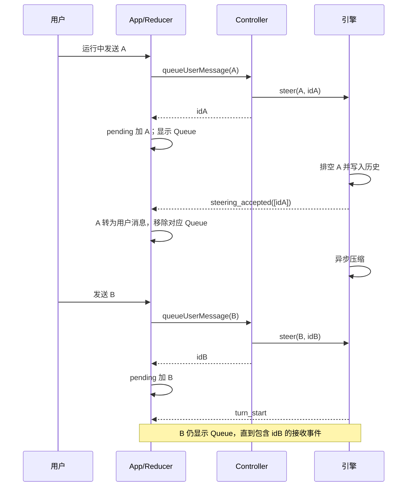

# TUI 换行、显式复制与可靠排队反馈设计

> 历史规格：本轮实现和最终验收以
> `docs/plans/tui-input-interaction-hardening/spec.md` v2 为准。

> 版本：v2；日期：2026-10-07；状态：设计评审通过，尚未实施。
> 本评审节点仅修改本规格，不修改源代码，不执行 Git 提交。
> 基线：当前工作区代码、根目录 README.md / CLAUDE.md、CLI README、项目索引，
> 以及 `docs/plans/tui-shift-enter-copy-queue/spec.md` 的既有实现。
> 后续实现以本规格的增量要求为准；旧规格保留为历史记录，不重新实施已存在的模块。

## 评审记录

评审依据为当前源码、已安装 Ink 5 的输入实现、CLAUDE.md 与官方终端协议文档。
逐节检查可行性、边界完整性、既有约定和改动规模；以下“已修正”均指设计正文已修正，
不代表源码已修复或实现测试已通过。未发现 P0；发现 P1 八项、P2 三项，均已在 v2 闭环。

| 编号 | 等级 | 关注点与代码证据 | 正文修正与验收 | 状态 |
| --- | --- | --- | --- | --- |
| R-01 | P1 | `agent-loop.ts::runAgentLoop` 无工具结束分支只检查 follow-up；正常结束会搁置 streaming 期间的 steering | §3.3 结束前优先回循环顶接收 steering；AC-28 | 已修正 |
| R-02 | P1 | `controller.ts` fast 接线实际调用 this.steer 再减计数；v1 误写为直接无 ID 投递，集合迁移会遗留保护项或漏掉 skills 激活 | §3.4 明确用户和 reviewer 入队分流，保留共同副作用；AC-29 | 已修正 |
| R-03 | P1 | Ink App.handleReadable 用无参数 read() 合并 writes；CSI-u 普通 Enter 写 CR 后可能与 paste/frame 合并，被 PromptInput 净化吞掉 | §3.1 显式提交帧与有序消费，扩展文件表；AC-30 | 已修正 |
| R-04 | P1 | `stdin-filter.ts::onData` 原始 NUL 可直达帧解码器；仅净化 paste 不能保证内部帧不被外部伪造 | §3.1 原始流入口去 NUL，生成帧后不再净化；AC-31 | 已修正 |
| R-05 | P1 | 替换整个 StatusBar 会丢失 redrawNonce 的 Ctrl+L 重绘载体、模式、服务和无 rail 时的 TODO 回退 | §3.4 保留 StatusBar 外壳与必要状态，Queue 替换元信息区域；AC-32 | 已修正 |
| R-06 | P1 | turn_end 等同步监听者可 abort；后续 checkpoint 仍可能发回执；App generation 门可能吞掉有效凭据 | §3.3 接收前检查 abort；§3.4 凭据按 ID 独立消费；AC-33 | 已修正 |
| R-07 | P1 | loadSession 只校验数组；force-stop 后 UI idle 不等于引擎 idle，v1 的完整校验/停止后恢复缺少边界 | §3.5 引擎守卫、载入预处理、启动取消顺序；AC-34 | 已修正 |
| R-08 | P1 | transcript-text 默认只回放 200 条，合并 pending 后仍会折叠中间 queued，不能兑现退出全文保留 | §3.5 待发送条目免于历史折叠；AC-35 | 已修正 |
| R-09 | P2 | 所有切分一致的描述忽略 12 ms 前缀超时；未知协议和 timer 清理未验收 | §3.1 明确支持边界；AC-36 | 已修正 |
| R-10 | P2 | ScreenMirror.plain 剥离整屏 ANSI，selectedText 会 trimEnd；直接复用不满足局部精确比较承诺 | §3.2 按选中 cell 范围逐行比较；AC-37 | 已修正 |
| R-11 | P2 | 新 CLI 必须配套新 Core 事件，否则 Queue 永远不确认；仅写 CHANGELOG 不足以防版本错配 | §8 明确最低依赖版本与整组回滚；AC-38 | 已修正 |

章节结论：§1–2 的需求与技术栈成立，修正接收保证及现状描述；§3–5 按上表补齐执行、
输入、状态和会话边界；§6 补足接线文件及测试；§7 增加行为验收；§8–9 补齐发布配套
与实施顺序。保留小范围 Core 事件扩展，不引入通用消息总线、持久化 outbox 或新配置。

## 1. 概述

本需求完善 AragonAgent 全屏终端界面的三个日常操作：Shift+Enter 在草稿光标处换行；
拖选文字只形成选区，用户按 Ctrl+C 才复制；Agent 运行期间提交的消息以
`Queue: <用户消息>` 持续反馈，直到引擎实际接收并纳入处理。项目使用 npm workspaces、
TypeScript strict / NodeNext、React 18、Ink 5 与 Vitest，核心执行引擎和终端宿主分别位于
`packages/core` 与 `packages/cli`。正文为中文，产品界面保留现有英文文案和 ASCII 约束。

当前代码已具有 Enter 序列归一化、释放后等待 Ctrl+C 的选区控制器、`queued` 转录条目。
因此不应把旧设计中的“尚未实现”继续当作现状。本次设计保留这些机制，补齐协议边界、
选区失效和队列接收时序。最重要的缺口是：引擎排空 steering 后会异步执行上下文压缩，
随后才发出 `turn_start`，而界面在该事件上把所有 queued 条目改成 user。
压缩期间新加入的消息仍在队列，却会被界面提前确认；控制器的用户消息计数也会提前归零。
另一个缺口是转录条目随内容滚动，单靠该条目无法保证排队状态始终出现在执行界面。

最终方案用引擎发出的消息 ID 接收凭据驱动状态变化；普通回合开始不再代表队列已经清空。
正常执行界面的固定状态行显示最早一条待处理消息和其余消息数量，转录仍保存逐条内容。
“接受和处理”在本规格中的明确边界是：消息已经写入引擎对话历史，后续上下文处理与模型
调用由引擎负责；它不表示模型已经完成回答，也不承诺外部工具操作成功。消息接收后移除
Queue 标记，保留普通用户消息；运行指示继续承担处理进度反馈。

## 2. 已核实的现状与设计边界

| 现有代码路径 | 已核实行为 | 本次决定 |
| --- | --- | --- |
| `input/enter-sequences.ts::rewriteEnterSequences` | 已识别 CSI-u 修饰值 2–8、无修饰 Enter、Alt+Enter | 保留；补显式修饰值 1；修复 burst 边界 |
| `input/stdin-filter.ts::handleOutsidePaste` | 改写发生在 burst 拼接和粘贴分类之前 | 不允许内部换行帧进入粘贴载荷 |
| `ui/PromptInput.tsx`、`ui/enter-frames.ts` | 已把换行帧和粘贴帧按顺序交给编辑器 | 复用；保持一次输入动作，不重建编辑器 |
| `ui/selection/selection-controller.ts::finishSelection` | 鼠标释放不复制，保留 settled 和 hold | 保留；完善新拖选、失焦看门狗及内容变化处理 |
| `ui/App.tsx` 全局按键回调 | Ctrl+C 复制位于清选区和退出阶梯之前 | 保留优先级；消费选区失败也不能落入退出 |
| `agent/reducer.ts::convertQueuedEntries` | `turnStart` 无条件转写全部 queued | 改为按接收事件 ID 精确转写 |
| `core/src/engine/agent-loop.ts::runAgentLoop` | 三个 steering 排空点；循环顶排空与 turn_start 之间有 await | 三处共用同步接收函数，并在真正入历史后发事件 |
| `agent/controller.ts` | `turn_start` 将 userSteerCount 清零 | 使用尚未接收 ID 集合派生计数 |
| `core/src/engine/agent-loop.ts` 无工具退出分支 | 只检查 follow-up，可能留下 steering | 退出前若仍有 steering，优先回到循环顶 |
| `agent/controller.ts` fast 接线 | 通过 this.steer 投递，再减回 userSteerCount | 显式内部投递路径，保留 skills 副作用，不占用户保护集合 |
| `ui/layout/AppShell.tsx` | header / toast / status 各占固定一行 | 复用 status 插槽，不增加终端高度预算 |
| `session/persist.ts::normalizeLoadedEntries` | 恢复 queued 时降级告警，只保留首行 | 保留不自动重发原则，改为保留完整正文 |

源码定位以符号为准，行号会随实现变化。项目索引用于导航，行为以当前源码为准。
读取时工作区已有 `package-lock.json` 与两个包的 package.json 修改；本节点不触碰它们。

本次不新增数据库、网络服务、REST 路由、WebSocket 通道、可调配置键或运行时依赖。
不改变 Enter 发送、Esc 双击中断、无选区 Ctrl+C 停服务/退出的既有语义。不自动编辑终端
配置，不全局开启 kitty 增强键盘模式。支持范围是应用收到可区分的按键字节；若宿主将
Shift+Enter 与 Enter 都发送为 CR，应用无法推断物理修饰键，必须提供绑定说明和 Ctrl+J。

## 3. 技术设计

### 3.1 输入链路与换行契约

链路保持为：终端字节 → stdin-filter → 内联帧 → Ink → PromptInput → editor-reducer。
换行意图继续使用 `ENTER_NEWLINE_FRAME = '\u0000n'`，不另建事件总线。显式 CSI-u 普通
Enter 使用新增 `ENTER_SUBMIT_FRAME = '\u0000r'`，防止 Ink 合并 chunk 后丢失提交边界。
内部帧必须只由过滤器产生：原始 stdin 在进入 pending、粘贴与 Enter 识别前去除 NUL，
包括 features.paste 为 false 的路径；wrapper 输出不能再次经过此入口净化。
分两块输入的 NUL 和 n/r 也不能拼成帧；普通字母保留。粘贴净化沿用既有规则。
不要沿用旧注释“任何键都不可能产生 NUL”的绝对
断言：正确保证来自边界净化和内部通道，而非物理键盘假设。

| 输入字节 | 归一化结果 | 编辑器结果 |
| --- | --- | --- |
| `\r` | 原样 | Enter 提交非空草稿 |
| `\n` | 原样 | Ctrl+J 插入一个换行 |
| `\x1b[13u`、`\x1b[13;1u` | 提交帧 | 普通 Enter，包括补全弹层的既有语义 |
| `\x1b[13;2u` 至 `\x1b[13;8u` | 换行帧 | 每个修饰 Enter 插入一个换行 |
| `\x1b\r`、`\x1b\n` | 换行帧 | Alt+Enter 换行 |
| bracketed paste 中的上述字节 | 粘贴净化 | 不执行按键，不提交草稿 |

只扩展已有有限识别表，不承诺完整 kitty 键盘协议，不接受未声明的修饰值、release/repeat
扩展或 modifyOtherKeys 方言。正则应覆盖可选 `;1`，replacer 显式区分 1 与 2–8，不能
继续仅凭“是否含分号”判断换行。最长严格前缀长度继续从表计算，所有切分位置均须测试。
kitty 官方定义 Enter 为 13、修饰值为位掩码加 1，说明此处显式值 1 的必要性。
参见 [kitty 键盘协议](https://sw.kovidgoyal.net/kitty/keyboard-protocol/)。

分包一致性限于下一块在既有 PENDING_FLUSH_MS（当前 12 ms）到期前到达。超时后保留
既有普通输入降级，不承诺恢复任意慢链路；单独 Esc 必须及时释放。测试覆盖超时前/后、
未知修饰序列、dispose 清 timer，不能靠扩大等待时间隐藏问题。

`handleOutsidePaste` 在识别到已声明的 Enter 序列时，以识别序列为边界处理：先将前面的
普通文本走既有分类/拼接逻辑，再同步 flush 尚存 burst，然后将归一化按键写入 wrapper，
最后处理后续文本。不得先把帧拼入 burst.body 再调用 sanitisePaste，因为这会剥掉 NUL、
留下字母 n。实现为 enter-sequences 中的纯分段函数和 filter 中短小的分发函数；分段只
扫描粘贴块之外的完整序列，跨 chunk 的保留由既有 feed 层负责。显式换行序列结束一次
启发式粘贴 burst，后续普通文本重新参与分类。Ctrl+J 裸 LF 仍遵守现有 heuristic paste
规则：它与多行未括号粘贴混在同一块时无法可靠区分，必须保留粘贴内容而不尝试提交。

Ink 的 readable/read 不保证 wrapper.write 的调用边界，多个同步 write 不能证明 Enter
是独立事件。enter-frames 扩展为识别 newline/submit，mergeWithPasteRuns 先保护粘贴块，
再按原顺序产生 text/paste/newline/submit 意图。PromptInput 在普通按键与补全分支之前
消费含帧输入：文本段沿用 editor input，换行段只插 LF，提交段调用与普通 Enter 共用的
处理函数，按当时草稿判断 slash 候选、空输入与提交。submit 前用 editor reducer 同步
算出的最新草稿（含此前 text/paste 段），不能读尚未 commit 的 React 闭包；submit 后
按既有清草稿规则处理剩余段。不得把 submit 合并成 LF 或执行 paste 内的协议字节。
无需新计时器或修改 Ink。原始 CR/LF 保留既有键与 heuristic paste 分类，不能把多行
粘贴里的 CR 升格为提交帧。PromptInput 保留 draftLimitRefusal 和 editor input action。
输入框中间、行首、行尾都在当前光标处插入；粘贴 token 保持原子，不展开成屏幕巨块。
补全弹层打开时，归一化换行不选择或执行 slash 命令。三个可输入 overlay 继续组合
`stripPasteFrames(stripEnterFrames(input))`，stripEnterFrames 同时剥离两种 Enter 帧，
禁止 NUL 或帧标记进入密钥与答案字段；overlay 内帧不触发确认或发送。
按键广播没有 stopPropagation，不能只在一个组件里 return 就声称其它消费者也已保护。

`/terminal-setup` 继续只输出说明：Windows Terminal 使用 sendInput 发送
`\u001b[13;2u`；保留 Ctrl+J 和 Alt+Enter 备选。说明让用户合并到自己的设置，不覆盖
原配置。Windows Terminal 的动作与键绑定机制见
[官方动作文档](https://learn.microsoft.com/windows/terminal/customize-settings/actions)。
帮助文本应说明“终端需发送独立 Shift+Enter 序列”，不能宣称对所有默认配置零设置可用。

### 3.2 选区与 Ctrl+C 的状态机

状态只有 idle、dragging、settled。鼠标左键按下进入 dragging，同时清除上一选区的
settled；motion 经现有 16 ms 合并；release 先提交最后一个 pendingFocus，再根据非空
文本进入 settled。release、单击、右键和看门狗路径都不得调用 copyText。

settled 时保持高亮和视口 hold，直到 Ctrl+C、其它键、重新选择、滚动、resize、overlay、
关闭鼠标或 dispose。看门狗到期统一调用 clear，释放 hold 并清除选区，避免出现
“高亮还在但 hasPendingSelection 为 false”的不可复制状态。看门狗仍仅对 dragging
工作，不给已释放的有效选区增加超时。

仅冻结滚动位置不能冻结正在生成的同一行。每次 decorate 更新 mirror 前，若已有 settled
选区，比较旧帧和新帧在选区范围内的纯文本；不同则清除选区并请求解除 hold，返回未高亮
的新帧。同样文字、仅 ANSI 颜色变化不清除。逐个选中行从 mirror.raw 与新 lines 剥离
ANSI，复用 rowSpan/sliceColumns 按 cell 取片段；比较时不 trimEnd、不用 mirror.plain
整屏 getter；缺失行按空行处理。实际复制继续使用 selectedText 的既有去尾空白规则。
该路径直接重置状态与 timer，不递归调用
会触发 repaint 的 clear；继续沿用 painting 防重入。由此 Ctrl+C 不会复制释放后偷偷
变化的内容。只在 settled 时执行局部文本比较，普通流式渲染不新增整屏处理。

App 全局按键按以下顺序执行：先保存是否存在 pending selection；若为 Ctrl+C 且存在，
调用 takeSelection，清除已有的 Ctrl+C 退出武装及 timer，非空载荷再调用 copyText，
最后无条件 return。即使载荷因帧变化变空，也不能把这次复制意图变成退出或停服务。
take 必须在 copy 前，以免 OSC 52 经 writeForeign 触发 differ.invalidate 时再消费选区。
复制反馈沿用 onCopied，`none` 给出失败提示；OSC 52/native 只表示已尝试传送，不能宣称
已验证剪贴板写入成功。复制失败后用户重新选择重试，本次不另加异步剪贴板协议。

无 pending selection 的 Ctrl+C 完整保留原阶梯。Esc 清选区后仍参与中断手势。
`--no-mouse`、`/mouse off` 和终端原生选择不在应用选区控制器掌握之内；宿主自身的
copy-on-select 设置只能由用户调整。README 必须明确这个边界。

### 3.3 引擎接收凭据

采用通用的 `steering_accepted` 事件，不在 Core 中引入 React、CLI 队列文案或宿主对象。
此事件表示文本已被同步写入 MessageManager，尚不代表远端模型完成请求。

`Agent.steer(message, id?)` 保持单参数调用兼容。Core 不生成 ID；调用者提供的 ID 仅作
不透明关联值，不写入 UserMessage.content，不传入模型提示词，不作为对话持久化字段。
MessageQueueManager 内部改存 `{ text, id? }`，新增 `drainSteeringItems()` 给引擎使用；
公开的旧 `drainSteering(): string[]` 继续通过同一排空操作返回 text，保持已有消费者兼容。
drain 仍一次性摘走当时所有消息，不接受按内容去重，也不按字符串相等匹配回执。

从 agent-loop 抽取同步 `acceptSteering(ctx)`：先检查 ctx.signal.aborted，为真则返回且
不排空；否则取出当次 batch，逐项 push UserMessage，
完成后为有 ID 的条目发出一个事件 `{ type: 'steering_accepted', ids }`。无 ID batch
照常接收，只是不发空事件。push 和 emit 之间不能 await；事件监听者沿用 Agent.emit
的异常隔离。所有三个排空点调用同一 helper，避免某条工具执行路径缺少回执。

循环顶的顺序是 acceptSteering → await runCompaction → 检查 abort → turn_start。
因此压缩期间新来的 B 不在此前 A 的接收事件中，B 继续显示 Queue。回执前的 abort
保留消息，回执后的 abort 表示消息已经纳入历史，但本轮未完成；不得恢复成待发送并重发。
重试、turn_end、agent_end、计时器和任何 UI 动画均无权确认接收。

正常无工具、无 CodeAct 的退出检查必须先判断 steering：若有消息且未 abort，直接
continue 回循环顶统一接收，再按已有逻辑处理 follow-up/结束。不要在 agent_end 里
另启 run，也不要新增第四套 drain。这样 streaming、压缩或 turn_end 同步监听者中
加入的消息，在正常结束前都有下一次接收机会；follow-up 仍低于 steering。
仅中断、错误或退出后保留的队列显示 paused，正常完成不能因漏查队列而 paused。

工具批次还必须保持对话结构有效：LLM 已产出 tool_use、但尚未执行任何工具就收到 steering
时，先为本批全部未执行调用补齐 skipped tool_result，再接收消息；工具之间的 checkpoint
只为剩余调用补齐。共用一段补齐逻辑，保证每个 toolCallId 恰有一个结果，随后回循环顶。
这是接收消息后能继续处理的前提，不能保留第一条 checkpoint 当前直接跳过结果的行为。
工具 checkpoint 在补齐 skipped 之前同样检查 abort；turn_end 监听者同步中断时不得
继续接收。工具结果补齐、消息入历史和回执之间不 await，回执监听者即使触发中断也不能
撤销已经完成的历史写入。本次只修 steering 引发的配对，不重构全部历史修复逻辑。

### 3.4 控制器、视图与固定队列反馈

控制器新增实例内 ID 分配器：构造时生成随机前缀，单调序号终身递增，reset/resume 不
重用。`steer(text)` 和 `queueUserMessage(text)` 都经同一个内部 enqueue 方法，在调用
agent.steer 前把 ID 放入受保护 pending 集合。前者仍返回 void，供已有自动化调用者使用；
后者返回 ID，供 App 创建可见条目。收到 steering_accepted 仅删除列出的 ID，
userSteerCount 改为集合 size，turn_start 不再清零。现有 fast reviewer 接线必须从
`this.steer(text); this.userSteerCount -= 1` 改为明确的内部无 ID 入队路径，不能保留减法，
也不能绕过 skills.absorbPendingFrames()。共享入队准备函数保留 skills 副作用，用户
及自动化 controller.steer 与 queueUserMessage 分配受保护 ID，reviewer 不分配 ID。
reviewer 的安全投递时机及 awaitingDrain 守卫保持原语义；用户保护数从集合实时读取。
经 controller.steer 的消息继续保守保护，避免清除用户数据。
clearAllQueues 同步清空引擎队列和此集合；内部 fast 清理仍必须满足集合 size 为零。
clearAllQueues 不能作为普通接收路径；只有显式会话重置或守卫允许的 reviewer 清理可调用。
App 收到 steering_accepted 时在一般 runGeneration 过滤前按 ID 派发精确确认，不推进
running/idle、不触发续跑；其余事件仍受旧 generation 门保护。ID 不复用意味着旧会话
凭据只会 no-op，强制停止前已实际接收的消息也不会因回执被过滤而永远显示 Queue。

App 的运行中提交同步执行 queueUserMessage，然后 dispatch steerQueued，期间没有 await。
Agent.steer 只入队，不同步排空，故 queued action 先于后续接收回执到达。调用成功后才能
清草稿；本次不增加可能拒收的队列容量策略，保留当前提交回调契约。所有正文仍走已有
粘贴展开和净化路径。非运行状态继续 prompt，starting 状态维持既有交互，不另建并发 run。

ViewState 新增 pendingSteering 数组，作为待接收用户消息的唯一视图数据源；它不依赖
可能被裁剪的 entries。steerQueued 同时写入 pendingSteering 与带 queueId 的 queued
entry，保留独立 entry.id。steeringAccepted 按 queueId 删除 pending，已存在的 queued
entry 原位变 user，同 ID、新对象。没有匹配 ID 时返回原 state；重复事件与未知 ID 都是
幂等 no-op。turnStart 仅负责创建 assistant 条目。不得在 turnStart 中继续扫队列。

当 queued entry 因 retain ring 被裁掉或被 /clear 清屏时，pending 仍保存全文及顺序；接收
回执只移除 pending，不重新插回已明确清掉的历史条目。普通接收转写会使 entryRevision
从既有默认值 x 变成 user 的 u，令高度缓存重新测量多行消息，无需新增修订计数。保留原条目位置，
不得额外追加第二份用户消息。业务 ID 与 e<n> 渲染 ID 不可混用。

AppShell 的 status 插槽始终保留 StatusBar 外壳；pending 非空且没有 overlay 时，内部
QueueStatusRow 替换模型/费用等元信息区域，pending 为空则恢复原渲染。必须保留行首
redrawChar(redrawNonce) 载体、agentMode/pendingMode、活跃服务数，以及无 TODO rail 时的
todoActive 回退；停止中的操作提示也不能消失。只改变这一行内容，不改变
header、toast、viewport 的行数，不增加
spinner，不影响 Composer 随文档滚动的既有设计。此取舍让等待消息临时优先于模型/费用
元信息，避免改造全局高度预算；错误 toast 和当前活动行仍保留。

显示规则固定如下：单条 `Queue: <首行摘要>`；多条 `Queue: <首行摘要> (+N more)`；
idle 但仍有 pending 时为 `Queue (paused): <首行摘要>`，多条同样附数量。摘要取首个非空
逻辑行，全部为空白才使用 `(empty)`。真实正文不截断、不修改。使用 string-width 和
项目现有按终端 cell 截断方法，预留前缀、数量后缀和 glyphs.ellipsis 的宽度，最终严格一行。
宽度预算先扣除上述必要状态及间隔，再给 QueueStatusRow 分配可用 cell 数，不能仍传
整个终端宽度。不足时依次省略可选元信息、缩短数量为 `(+N)`、暂停前缀为 `Queue(p): `，
再截断摘要。必要状态用紧凑表达，停止提示可缩为 `Esc!`，help 解释为再次 Esc 强停。
40 列下仍保留 Queue 前缀、至少一个完整正文 grapheme 或省略符及非零剩余条数。
计数过长可显示 `99+`，真实数据不截断。模式、服务、TODO 由 StatusBar 统一预算；
极窄组合中计数片段可缩至标识加 `+`（如 `svc+`、`todo+`）而非隐藏，完整数值仍可在
对应面板/命令查询。颜色使用 theme.muted，前缀用现有强调色；ASCII/reducedMotion 无动画。
多行消息在转录条目仍显示已有额外行数，完整内容在接收后变成 UserEntry。
40×12 最小可用窗口也必须显示前缀和部分内容；更小窗口沿用 tooSmall 占位。
overlay 打开时队列状态继续维护，关闭后立即恢复，不把队列覆盖在设置输入上。



### 3.5 会话和退出边界

/clear 只清转录，pendingSteering 不清，固定状态行继续提示。/reset 和 /resume 的命令
handler 均检查 controller.isRunning()，不能只依赖 App 的 interactionPhase；强制停止后
视图 idle 但引擎尚未退栈也须 warn 并返回。App 已有运行中正则拒绝逻辑继续保留。
引擎真正 idle 后 /reset 清历史、
引擎队列、控制器集合与 UI pending。/resume 先完整读取及校验文件，成功后才清旧队列、
替换历史并 restoreEntries；读取失败保留旧会话。校验不能止于现有“两个字段是数组”：
loadSession 的纯预处理先检查消息/条目是可消费对象、queued.text 是字符串、可选
queueId 是字符串、模型字段类型正确，并完成条目降级与 TODO 的既有归一化。载入错误
必须先于 clearAllQueues/replaceMessages。允许旧文件缺 queueId/model/todos，沿用
已有缺省策略，不引入通用 schema 库或新存档版本。同步提交阶段无 await，保留
clearMessages/replaceMessages 对 startupSequence 的失效动作，以及 makeCtx.dispatch
对 submissionSequence/starting 的取消动作；载入失败则两者均不能失效。
旧消息回执因 ID 不复用而无法命中新会话。

会话文件不承诺恢复未发送的内存队列。保持既有 SavedSession 结构，用纯函数
mergePendingEntries 合并 entries 与 pending 中缺失的 queued 条目后再保存：按 queueId
去重，新增序列化条目使用 `pending:<queueId>` 作为不冲突 ID。/save 和 App 的
publishExitSnapshot 均使用同一函数；后者的 effect 依赖加入 pendingSteering。
当前 TUI 未发现自动保存会话接线，本次不新增自动落盘；exec 的 session store 保持原样。
恢复时 queued 一律转为 warn notice，文本为
`Queued but never sent: ` 加完整原文，不自动重新入队，不只保留第一行。
restoreEntries 的 pending 初始化为空；历史旧条目没有 queueId 也能正常降级。
退出快照的文本转录同样需要表达尚未发送的完整内容，防止正常退出留下静默丢失的印象。
transcript-text 的 maxEntries 折叠仅作用于非 queued 历史；所有尚未接收的 queued
条目按原顺序保留且完整输出，不被 DEFAULT_MAX_ENTRIES=200 的中间省略吞掉。
合并仅补缺失 queueId，不把同文本不同 ID 去重。超过 retain/maxEntries 的场景必须
同时验证 /save JSON 和退出回放。paused 不自动启动新 run，下一次用户启动的 run
由引擎接收保留队列；README 说明 /reset 丢弃、/save 保存为未发送记录，不承诺自动重试。
正常退出快照只回放到终端，不等于持久化；用户需显式 /save 才有可恢复文件，不能承诺
进程崩溃前最后一次提交已经落盘。

## 4. 接口设计

以下为待实现契约，不是本节点写入源码的实现。公开对象使用 interface。

```ts
// core/src/engine/steering.ts
export interface SteeringMessage {
  readonly text: string;
  readonly id?: string;
}
// MessageQueueManager 的兼容扩展
pushSteering(message: string, id?: string): void;
drainSteering(): string[];
drainSteeringItems(): SteeringMessage[];

// core/src/engine/agent.ts：第二参数可省略
steer(message: string, id?: string): void;

// core/src/types.ts；加入 AgentEvent 联合并从 index.ts type-export
export interface SteeringAcceptedEvent {
  type: 'steering_accepted';
  ids: readonly string[];
}

// cli/src/agent/controller.ts
steer(text: string): void;
queueUserMessage(text: string): string;

// cli/src/agent/queued-messages.ts
export interface PendingSteering {
  readonly queueId: string;
  readonly text: string;
}
mergePendingEntries(entries: Entry[], pending: readonly PendingSteering[]): Entry[];

// cli/src/input/enter-sequences.ts
export interface EnterRun {
  readonly kind: 'text' | 'key';
  readonly text: string;
}
splitEnterSequences(text: string): EnterRun[];
rewriteEnterSequences(text: string): string;
trailingEnterPrefixLength(text: string): number;

// ViewAction 的新增/修订分支
{ type: 'steerQueued'; queueId: string; text: string }
{ type: 'steeringAccepted'; ids: readonly string[] }
```

splitEnterSequences 的 key.text 为提交帧或换行帧；text 分支为已在入口去除 NUL 的原文。
ENTER_SUBMIT_FRAME 在 input/limits.ts 定义；enter-frames 的有序输出增加 submit 意图，
该意图不属于 editor 的文本 input action。StatusBar 新增可选 queue 展示参数（pending、
暂停状态），内部向 QueueStatusRow 传已扣除必要状态的宽度；不传时输出保持兼容。
rewriteEnterSequences 从相同识别表产生，避免两个解析器分歧。新增 types-only 导出不会
改变 public-api.test 的运行时导出列表，但 AgentEvent 联合增加成员会影响外部 exhaustive
switch；必须在 Core API.md 和 CHANGELOG 中声明，不能把“运行时导出数不变”当成没有
兼容成本。旧单参数 steer 与 drainSteering 返回值维持兼容。

CLI 不新增命令。/terminal-setup、/save、/resume、/reset 的行为修订如前文。
aragon exec 现有 stream-json schema 不新增事件类型；其 runner 忽略 steering_accepted，
原 turn_start / result / 退出码行为不变，新增回归证明这一点。headless reducer 则可以识别
该事件，但没有 visible pending 时返回空效果。配置文件与 LLM Message 类型均不变。

## 5. 数据模型与不变量

| 数据 | 所有者/生命周期 | 约束 |
| --- | --- | --- |
| steeringQueue: SteeringMessage[] | Core，跨 run 存活直到 drain/clear | FIFO；文本不去重；不透明 ID 不进模型 |
| protectedSteeringIds: Set<string> | Controller，实例期 | 接收才删，clearAllQueues 才全清，不被 turn_start 归零 |
| pendingSteering: PendingSteering[] | ViewState，当前会话 | 只包含 TUI 用户提交；独立于转录裁剪；无 timeout |
| queued Entry 的 queueId | Entry 内可选，兼容旧存档 | 新运行时条目必有；entry.id 只管渲染 |
| selection/dragging/settled/hold | SelectionController | settled 必须非空且释放完毕；所有清理路径释放 hold |
| EnterRun / NEWLINE 与 SUBMIT 帧 | 输入过滤器与编辑器之间 | 入口去 NUL；帧不进 payload、用户正文或 overlay；提交意图不等于换行 |

ID 的唯一性由 CLI 分配器保证；第三方 Core 消费者若提供重复 ID，应自行承担关联歧义，
API 文档明确这一前置条件。Core 不为 ID 维护永久去重表，以免无界增长或改变消息语义。
相同文本连续发送两次必须拥有两个 ID、生成两条用户历史，并分别确认。

关键不变量：没有入历史就没有回执；没有匹配回执就没有成功转写；界面不依赖渲染时间
猜测引擎状态；复制只由显式按键触发；一次 Ctrl+C 只能有一种语义；任何输入净化不能
把内部帧变成普通字母；固定状态行始终只占一行；会话恢复不能把未发送消息伪装成已发送。

## 6. 文件 / 模块变更计划

以下是**下游实施范围**，不是本节点已经修改的清单。无须变更的既有文件只作为验收对象。

| 文件 | 动作 | 单一目的 |
| --- | --- | --- |
| `packages/cli/src/input/enter-sequences.ts` | 修改 | 添加 ;1 并提供共享识别表的 EnterRun 分段 |
| `packages/cli/src/input/limits.ts` | 修改 | 增加 ENTER_SUBMIT_FRAME 常量 |
| `packages/cli/src/input/stdin-filter.ts` | 修改 | 在 burst 与显式按键边界正确 flush，隔离内部帧 |
| `packages/cli/src/ui/enter-frames.ts` | 修改 | 按顺序解码 newline/submit，与 paste 合并；剥离两种帧 |
| `packages/cli/src/ui/PromptInput.tsx` | 修改 | 有序执行帧意图，提交读取最新草稿并复用 Enter 行为 |
| `packages/cli/src/ui/selection/selection-controller.ts` | 修改 | 清旧 settled、统一看门狗清理、清除内容变化选区 |
| `packages/cli/src/ui/App.tsx` | 修改 | 精确排队提交、复制优先分支、固定状态行和退出快照接线 |
| `packages/cli/src/ui/QueueStatusRow.tsx` | 新建 | 按分配宽度截断的单行队列片段 |
| `packages/cli/src/ui/StatusBar.tsx` | 修改 | Queue 分支保留重绘载体与模式/服务/TODO/停止提示 |
| `packages/cli/src/agent/queued-messages.ts` | 新建 | pending 匹配、序列化合并等纯数据操作 |
| `packages/cli/src/agent/reducer.ts` | 修改 | pending 状态、按 ID 接收，删除 turnStart 全量确认 |
| `packages/cli/src/agent/controller.ts` | 修改 | ID 分配、protected 集合、用户可见入队接口 |
| `packages/cli/src/commands/builtins.ts` | 修改 | 终端说明、save 合并、reset/resume 生命周期守卫 |
| `packages/cli/src/session/persist.ts` | 修改 | 提交前载入预处理与校验；未发送条目恢复保留全文 |
| `packages/cli/src/ui/transcript-text.ts` | 修改 | 输出尚未发送全文，queued 不参加历史折叠 |
| `packages/cli/src/ui/overlays/HelpOverlay.tsx` | 修改 | 帮助与实际终端/复制/队列语义一致 |
| `packages/cli/src/ui/Composer.tsx` | 修改 | 换行提示注明 terminal-setup 入口，保持宽度降级 |
| `packages/core/src/engine/steering.ts` | 修改 | 内部 envelope、兼容旧 drain API |
| `packages/core/src/engine/agent.ts` | 修改 | steer 可选 ID 透传 |
| `packages/core/src/engine/agent-loop.ts` | 修改 | 三处接收统一发凭据，保证工具结果成对 |
| `packages/core/src/engine/accept-steering.ts` | 新建 | 同步入历史与接收事件的集中实现 |
| `packages/core/src/types.ts` | 修改 | 定义 SteeringAcceptedEvent |
| `packages/core/src/index.ts` | 修改 | 仅 type-export 新事件及 SteeringMessage |
| `packages/core/API.md`、`packages/core/CHANGELOG.md` | 修改 | 记录源兼容接口与新事件联合成员 |
| `packages/cli/README.md`、`packages/cli/CHANGELOG.md` | 修改 | 用户操作、限制、paused 和恢复行为 |
| `packages/cli/src/__tests__/enter-sequences.test.ts` | 修改 | 序列表及每个 chunk 切分位置 |
| `packages/cli/src/__tests__/stdin-filter.test.ts` | 修改 | 粘贴 burst 与显式换行相邻组合 |
| `packages/cli/src/__tests__/prompt-input-commits.test.tsx` | 修改 | 插入位置、补全、混合帧、一次输入提交 |
| `packages/cli/src/__tests__/selection-controller.test.ts` | 修改 | 选区生命周期与内容变化 |
| `packages/cli/src/__tests__/interrupt-ladder.test.tsx` | 修改 | 复制不退出、不停服务、不留武装 |
| `packages/cli/src/__tests__/fast-reviewer.test.ts` | 修改/回归 | reviewer 队列保护与用户 ID 集合迁移一致 |
| `packages/cli/src/__tests__/reducer.test.ts` | 修改 | 替换旧全量 turnStart 确认断言 |
| `packages/cli/src/__tests__/queue-status-row.test.tsx` | 新建 | 固定行、宽度、数量、paused、ASCII |
| `packages/cli/src/__tests__/queue-lifecycle.test.tsx` | 新建 | 真实 Controller + App 的接收与压缩竞态 |
| `packages/cli/src/__tests__/queued-messages.test.ts` | 新建 | ID 去重合并、裁剪与清屏保存 |
| `packages/cli/src/__tests__/session-store.test.ts` | 修改 | 全文恢复与不自动重发 |
| `packages/cli/src/__tests__/transcript-text.test.ts` | 修改 | 退出快照包含未发送全文 |
| `packages/cli/src/__tests__/terminal-setup-command.test.ts` | 修改 | 只读终端配置说明与回退键 |
| `packages/cli/src/__tests__/queue-exec-compat.test.ts` | 新建 | 新 Core 事件不改变 exec 输出契约 |
| `packages/core/src/__tests__/steering-acceptance.test.ts` | 新建 | FIFO、精确回执、旧 drain 和工具结果成对 |
| `packages/core/src/__tests__/compaction-loop.test.ts` | 修改 | 用可控压缩 Promise 证明竞态消失 |
| `packages/cli/package.json`、`package-lock.json` | 按发布版本修改 | CLI 最低 Core 依赖必须包含接收事件；保留工作区已有改动 |
| `docs/plans/tui-input-queue-reliability/manual-test.md` | 后续新建 | 记录真实终端矩阵、版本、操作与结果 |

现有 editor-reducer、QueuedEntry、Transcript、AppShell、
document-layout、clipboard 逻辑原则上复用；用行为测试确认，不做为新建功能的重复实现。
如果代码核验发现它们不满足上文契约，先在此表记录具体缺口再修改，不借机整体重构。
新增模块按 CLAUDE.md 的 1000 行/60 行约束拆职责，App/controller 的接线保持短小。

## 7. 测试与验收标准

### 7.1 自动化行为验收

| 编号 | 场景与刺激 | 必须观察到的结果 |
| --- | --- | --- |
| AC-01 | 草稿中间按 Shift+Enter，再普通 Enter | 光标处一个 LF；仅普通 Enter 提交完整多行 |
| AC-02 | 识别表逐项输入，按每个字节边界拆包 | 行为与完整输入一致，无 `[13;2u` 或 n 泄漏 |
| AC-03 | 显式 ;1、无分号 Enter | 等同普通 Enter，不误插入换行 |
| AC-04 | 先形成 Tier 2 burst，15 ms 内输入 Shift+Enter | 先落原粘贴，再落换行；载荷无内部帧字母 |
| AC-05 | bracketed paste 内含 Enter 序列、NUL、中文和 emoji | 不执行按键、不提交、净化后内容完整 |
| AC-06 | Shift+Enter 时 slash/@ 补全打开 | 换行；不执行命令、不接受候选 |
| AC-07 | Settings/Question/Plan 的文本字段收到帧 | 无 NUL、无帧字符，原有单行输入规则不变 |
| AC-08 | release 非空选区，等待持续流式输出 | clipboard 调用次数为 0；静态内容高亮保留 |
| AC-09 | settled 选区 Ctrl+C，后台服务运行且已有退出武装 | 复制一次，服务不停止，进程不退出，武装清除 |
| AC-10 | hasPending 后 takeSelection 返回 null 或复制 none | 当前 Ctrl+C 仍被消费；不落入退出阶梯 |
| AC-11 | 新 press、看门狗、滚动、resize、overlay、dispose | 状态一致，hold 释放，不留不可复制高亮 |
| AC-12 | 同行文字更新但 viewport shift 不变 | 选区清除；纯颜色变化不清除 |
| AC-13 | 无选区 Ctrl+C，及 Esc 双击 | 原停服务/退出/中断测试保持通过 |
| AC-14 | 工具阻塞期间连发相同文本两次 | 两个不同 ID、两条 Queue；不按内容去重 |
| AC-15 | A 被 drain，压缩挂起时发送 B，再解除压缩 | A 已确认；turn_start 后 B 仍 Queue、仍受清队列守卫保护 |
| AC-16 | 中断后运行结束、模型错误、重试、接收前 abort | 不凭这些事件清除 pending；运行中保持 Queue，停止后显示 paused |
| AC-17 | 入历史后立即 abort | 不再标待发送，不自动重发；正常错误/中断反馈 |
| AC-18 | LLM 产出多个工具调用，在两个 checkpoint 分别 steering | 未执行调用都有且仅有一个 skipped result；回执正确 |
| AC-19 | 重复回执、未知 ID、上一会话迟到 ID | 无副作用，不删除其它消息 |
| AC-20 | pending 时滚动到旧历史、流式输出追加超过一屏 | 固定 Queue 行仍可见，输入与滚动状态不跳变 |
| AC-21 | 40×12、80×24、120×40；CJK/emoji/长首行/多行 | 高度恒一行，宽度不溢出，数量后缀不消失 |
| AC-22 | /clear 或 entries 裁剪后仍 pending，然后 /save | 队列仍显示；保存包含完整待发送正文且不重复 |
| AC-23 | 恢复新旧 queued 存档 | 全文 warn notice；pending 空；引擎没有自动重发 |
| AC-24 | 运行中 /reset、/resume；idle 后再操作 | 运行中拒绝；idle 成功清旧队列，文件错误不破坏旧状态 |
| AC-25 | Queue 转多行 user 的已缓存条目 | 同 entry.id、不同对象，高度重新测量、无重复条目 |
| AC-26 | headless / exec 遇到 steering_accepted | 既有结果、退出码和 stream-json schema 不变 |
| AC-27 | 所有新源码及界面在 ASCII / reducedMotion 下运行 | glyphs 扫描通过，无额外 spinner 和非 ASCII 字面量 |
| AC-28 | 无工具正常流式回复期间入队，或在 turn_end 监听者中入队；同时有 follow-up | 先回循环顶接收 steering，再处理低优先级 follow-up；正常结束时无残留 Queue |
| AC-29 | 真实 Controller + FastWiring，reviewer 与用户同批/交错入队，再错误或 abort | skills 副作用保留；reviewer 不占用户保护集合；fast 清理不能删未接收用户消息 |
| AC-30 | 同一 Ink read 合并 paste、Shift+Enter、CSI-u ;1、尾随文字；打开 slash 弹层 | 最新草稿按顺序编辑/提交一次；尾随文字进下一草稿；单独 Enter 与提交帧语义一致 |
| AC-31 | 原始 NUL+n/r 同块或跨块，paste on/off、bracketed/burst；overlay 收两种生成帧 | 外部 NUL 不伪造帧，普通 n/r 保留；只有生成帧执行意图，overlay 不确认 |
| AC-32 | pending 下 Ctrl+L，40×12 且模式/待切换模式、服务、无 rail TODO 和停止提示同时存在 | 帧字节确实更新；必要状态与 Queue 可见，严格一行，正文按可用 cell 截断 |
| AC-33 | turn_end 同步 abort；回执监听中 force-stop；之后注入重复/旧会话回执 | 前者不 drain；后者已入历史的 ID 仍确认且不把 UI 改回 running；旧 ID 无影响 |
| AC-34 | force-stop 后引擎未 idle 时 reset/resume；含坏 queued.text/model 的存档；starting 时有效/无效载入 | 引擎运行时拒绝；文件错误不动历史/队列/启动序号；有效载入取消旧启动并清旧队列 |
| AC-35 | queued 位于超过 200 条历史的中间，或 pending 超过 retain；同文不同 ID、多行 | save 每个 ID 全文一次；退出回放不省略 queued、不截正文、不重复 |
| AC-36 | 序列每个切分位置在前缀超时前/后到达；单独 Esc、未知序列与 dispose | 超时前一致；超时后按既有降级且不挂起；没有遗留 timer 或误认已声明按键 |
| AC-37 | 选中尾空格、CJK、组合 emoji；只改颜色、选外文字、选内文字、删除选中行 | 仅选内可见文本变化清选区；hold 正确释放；比较不扫描无关行 |
| AC-38 | 发布包依赖解析与回滚检查 | CLI 不能解析到缺少回执的 Core；版本说明包含事件联合变化；回滚成套 |

竞态测试使用受控 deferred Promise：在 compaction.start 后阻塞压缩器，提交 B，再 resolve；
禁止靠 sleep 猜时间。Core 测试使用 fake provider 和真实 Agent/MessageQueueManager，
记录实际 MessageManager 历史与事件顺序，不能只直接调用 reducer 来“证明”引擎接收。
UI 集成复用 terminal-harness 和 scripted-provider，断言最终可见帧及控制器调用，避免以
源码字符串包含某个分支代替行为验证。旧 reducer 测试中“turnStart 转写 EVERY queued”
必须反转为“turnStart 不确认任何 queued”，不能保留两个相互矛盾的期望。
AC-30 必须用 Ink 实际 readable/read 路径复现合并，不能只订阅 wrapper 的 data 事件。
AC-29 放入 queue-lifecycle 的真实控制器集成测试，fast-reviewer 单测作补充；AC-32 同时
覆盖静态 Queue 下 Ctrl+L，不能靠一次新消息更新掩盖重绘载体缺失。

### 7.2 实施后的命令与人工验收

下游按顺序执行，每条成功后再继续；PowerShell 不使用 `&&` 连接。下面是实施验收计划，
本设计节点没有运行这些测试，不将历史任务的通过数字作为本次结果。

```text
npm run build -w packages/core
npm run typecheck
npm run test -w packages/core -- src/__tests__/steering-acceptance.test.ts src/__tests__/compaction-loop.test.ts
npm run test -w packages/cli -- src/__tests__/enter-sequences.test.ts src/__tests__/stdin-filter.test.ts src/__tests__/queue-lifecycle.test.tsx src/__tests__/queue-status-row.test.tsx
npm test
npm run build
node packages/cli/dist/cli.js --version
```

人工矩阵至少覆盖 Windows Terminal + PowerShell、本任务 Windows 环境；另在可用设备
覆盖 VS Code 集成终端和一个支持自定义字节绑定的 Unix 终端。记录 Node/终端版本和
Shift+Enter 是否配置；无法实际访问的平台标记未测，不能把字节单测替代真实终端结果。
验证多行输入发送、选区释放不改变剪贴板、Ctrl+C 复制、长工具期间排队及滚屏、错误后
paused、设置 overlay 开关、终端缩放、退出后终端仍正常。剪贴板人工检查不能只看 toast。

交付准入：AC 全部通过；Core 无宿主耦合和公共运行时导出检查通过；CLI 类型检查、
全量测试、构建和启动验证通过；真实 Windows 终端有记录；没有新增未说明的源兼容破坏。
本节点自身验收仅包括设计章节完整、路径准确、字数充足、Git 可见、修改范围合规及任务
状态回报成功。

## 8. 风险、缓解与备选方案

| 风险 | 缓解/已选策略 |
| --- | --- |
| 终端吞掉 Shift 修饰键 | 官方格式绑定说明与 Ctrl+J；不从 CR 猜物理按键 |
| NUL 帧被粘贴净化成 n | 明确键/文本分段，显式键前 flush burst，组合用例验证 |
| 未括号粘贴与按键天然歧义 | 显式已知序列作为边界；其余保留既有 heuristic，不声称完全区分 |
| 接收过早导致消息静默丢失 | 精确 ID 回执；UI 与用户队列保护计数去除 turn_start 推断 |
| 新 Core 事件影响外部 exhaustive switch | API/CHANGELOG 明示；type-export；兼容旧调用；发布时按仓库版本流程处理 |
| 新 CLI 安装到旧 Core，队列永不确认 | CLI 依赖下限指向首个带回执的 Core 版本；检查实际依赖解析；整组回滚 |
| 复制时底层文本变化 | settled 文本变化即清选区，保证高亮含义诚实 |
| 系统 clipboard helper/OSC 52 无确认 | 沿用“尝试发送”反馈，人工检查真实剪贴板 |
| Queue 挤占状态元信息 | 保留 StatusBar 外壳、重绘载体及必要状态，仅替换元信息区域，完成即恢复 |
| 重复消息与旧会话事件串扰 | 不透明唯一 ID，不按 text/timestamp 匹配，reset 不复用计数 |
| 待处理队列长期积累 | 本次继承内存队列性质，不引入静默丢弃；后续容量限制须先设计草稿拒收契约 |
| 显式保存前异常退出 | 不承诺 crash-safe outbox；明确 /save 边界，恢复告警保留全文 |

评估过三条路线。第一，原样复用 turn_start 全量确认：改动少，但异步压缩窗口会错误确认，
拒绝。第二，在 CLI 比较历史文本判断是否接收：不改 Core，但重复正文、压缩改写和自动化
注入都会产生歧义，拒绝。第三，引擎按 ID 发出 host-neutral 接收事件：需要小范围扩展
Core 契约，但给 UI 和队列保护同一个事实依据，选择此路线。

固定队列显示也评估过新建独立 footer 行：它会牵涉当前统一滚动文档、最小高度、rail 和
布局预算，收益不足以抵消改造面积。因此复用已有 status 行，保留逐条转录内容。
不增加消息编辑、取消、排序、重启自动重发等用户未要求的队列管理功能。

发布由后续发布流程执行：先确定含 steering_accepted 的 Core 发布版本，再将 CLI 的
Core 依赖下限和 lockfile 解析指向该版本，构建/测试与包依赖检查使用同一组产物。
不得仅在 workspace 链接下通过测试就发布仍允许旧 Core 的 CLI。若需回滚，CLI/Core
整组回滚到上一兼容组合；存档 queued 的 queueId 是可选附加字段，不靠 ID 恢复内存队列。
本评审不改版本文件、不发布，也不覆盖工作区原有 package.json/lockfile 修改。

## 9. 下游实施顺序

1. 添加 Core 接收事件和兼容队列接口，先用测试固定三个 checkpoint、compaction 窗口和
   skipped tool_result 配对、abort 和无工具结束前的 steering 优先接收；保证旧 drain
   和单参数 steer 兼容。
2. 接入 Controller 的 ID 集合，再接 reducer 的 pending 和精确回执；移除两个 turn_start
   推断点，迁移 reviewer 入队分流。先通过真实引擎竞态测试，再接入 StatusBar 的
   QueueStatusRow 及重绘/必要状态保留。
3. 接入清屏、会话保存/恢复和退出文本，使 pending 不因转录裁剪丢失或恢复后假发送。
4. 完成原始 NUL 边界、burst 分段、提交帧和 ;1 兼容，以及选区生命周期补强；同步提示、
   帮助与文档，验证 Ink 合并读取。
5. 运行本规格命令和终端矩阵，记录 manual-test.md；审查实际文件差异与所有 AC。

实施方不得把本节点交付的“设计完成”报告当成实现或测试已经完成。本规格所有新增行为
均是后续工程任务；现有行为与计划行为已在第 2 节和文件表中分别标明。

## 评审结论

**通过**。

v2 已在正文修正 8 项 P1 和 3 项 P2，未发现 P0，未解决 P0/P1 为 0。方案可以用当前
TypeScript、React/Ink 与 Core 事件机制实现；修订保持现有层次和终端高度预算，无新增
运行时依赖，不要求通用队列框架。仅修改本规格，未修改源码、执行实现测试或提交 Git。

此结论批准进入实施，不代表功能已交付。下游须通过 AC-01 至 AC-38、§7.2 的构建/
测试及真实 Windows 终端验收，并在发布时完成 Core/CLI 依赖配套；这些是明确的实施
验收要求，不是尚待决定的设计问题。无法访问的其它终端按未测如实记录。
